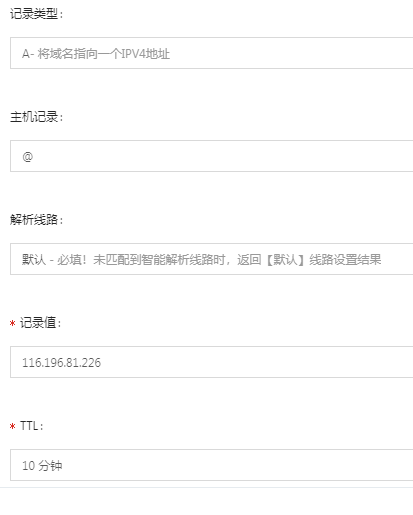
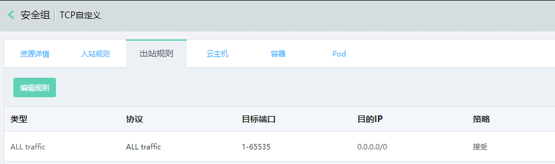
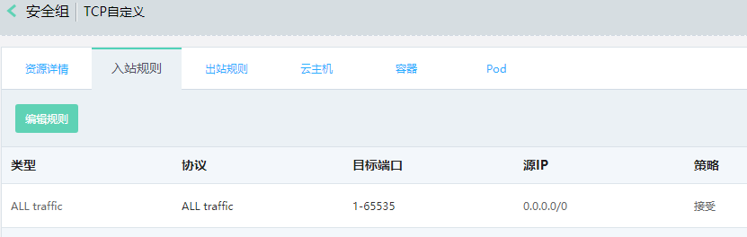

## 域名解析

注意 `主机记录`是@，表示没有域名前缀。域名解析有问题可以参考 [阿里云网站运维检测平台](https://zijian.aliyun.com)

## 开放云服务器出入端口

域名解析完成后还要配置云服务器的安全组，否则入网和出网端口没有放开，这里我将所有1-65535的进出口端口都放开了，实际运用中根据自己的需求自定义端口和协议开放特定的出入口
> 出站端口

>入站端口

