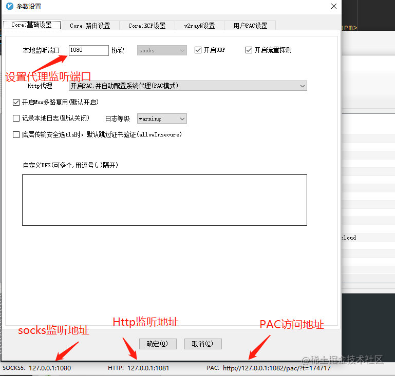
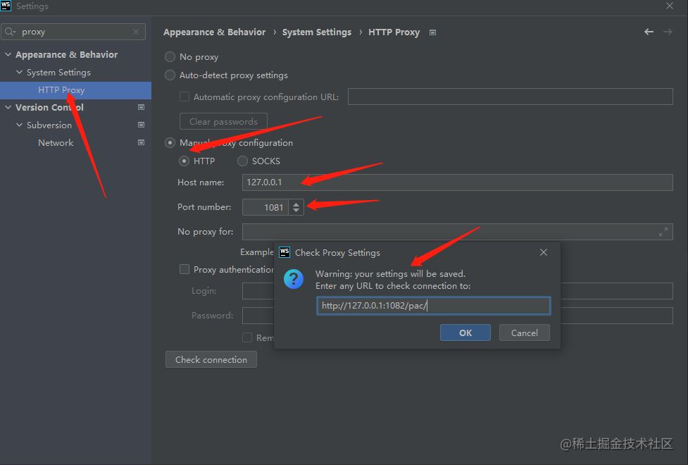
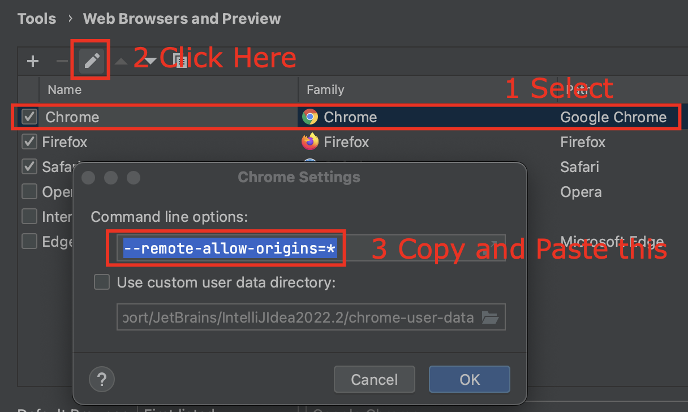
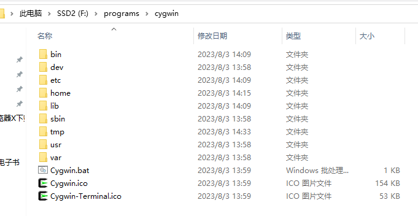

## V2rayN代理软件设置

[ssr节点](https://www.duyaoss.com/) <br>
v2rayN下载地址：<a href='https://github.com/v2ray/v2ray-core'>https://github.com/v2ray/v2ray-core</a>



## vscode debug

```shell
npm run start # app launch at: http://localhost:8000
# open Run and debug panel
# add configuration: Chrome Launch
{
      "name": "Launch Chrome",
      "request": "launch",
      "type": "chrome",
      "url": "http://localhost:8000",
      "webRoot": "${workspaceFolder}"
}
# click 'start debugging' button start debug 
```

## webstorm 配置

### 软件破解

#### webstorm 2021.3 版本激活教程

注意不是2021.3.1版本：<a href='https://www.bilibili.com/read/cv14405690'>https://www.bilibili.com/read/cv14405690</a>

#### [jetbrains 2021.3.x、2021.2.x、2021.1.x等 版本激活教程](https://www.yuque.com/u12033157/dqgh2a/hc2eba)

注意：webstorm 2021.3.1版本之后需要登陆账号才可以试用，而且绑定账号，试用期结束后无法再次试用

#### webstorm代理设置

ieda中插件市场下载太慢，v2rayN全局代理不生效，需要给idea配置代理，打开idea Settings- System Settings - http proxy



#### webstorm 常用插件

- theme： settings-plugin - (one Dark theme)
- [Emmet everywhere插件](https://docs.emmet.io/abbreviations/syntax/)
- Database Navigator （数据库连接插件）
- .env files support
- statistic (统计项目代码)
- camelCase (驼峰命名和下划线命名转换 shift + alt + u / ctrl + shift + u)
- rainbow bracket

#### IDEA 常用插件

- maven helper: 用来分析 pom.xml 文件中的依赖关系

#### webstorm常见问题

- `tailwindcss` 不能智能提示

```text
需要升级到 webstorm 2021.3.1以后才可以智能提示
```

- webstorm `ctrl + tab` 键不显示 npm工具栏

```text
在 `package.json` 上点击右键，然后选择 `show npm scripts` 选项即可，
会发现左下角侧边栏上出现了一个 npm 的按钮
```

- webstorm 光标变粗解决方案

```text
应该是不小心按了键盘上的 insert 键，再按下切换回来就可以
```

- webstorm 不能识别 vue项目中 alias 路径

在 WebStorm `Setting -> Language & Framework -> JavaScript -> Webpack`
由 `auto -> manual -> auto`,切换一下，`webstorm` 就会自行 `analyze`

- [webstorm 不识别 node 中的 require/process 等](https://blog.csdn.net/KaiSarH/article/details/105035307)

  在 WebStorm `Setting -> Language & Framework -> JavaScript -> library` 中 `download - node`

### webstorm debug

webstorm debug 出现： Please ensure that the browser was started successfully with remote debugging port opened. Port
cannot be opened if Chrome having the same User Data Directory is already launched.

> Settings -> Tools -> Web Browsers and Preview


- [webstorm debug](https://juejin.cn/post/7160667398855458853)
- [debug-angular-app-in-intellij-with-chrome-under-windows](https://stackoverflow.com/questions/64659160/debug-angular-app-in-intellij-with-chrome-under-windows/76039479#76039479)

## npm代理配置

### 使用nrm管理registry地址

```shell
npm install -g nrm
nrm add npm http://registry.npmjs.org
nrm add taobao https://registry.npm.taobao.org
# 切换npm registry地址
nrm use taobao
nrm use npm
# 移除代理
npm config delete proxy
npm config delete https-proxy
# 配置代理
npm config set proxy=http://127.0.0.1:1081
# 查看代理
npm config get proxy
```

## git 代理配置

```shell
# 设置全局代理
git config --global http.proxy http://127.0.0.1:1081
git config --global https.proxy https://127.0.0.1:1081
# 使用socks5代理的
git config --global http.proxy socks5://127.0.0.1:1081
git config --global https.proxy socks5://127.0.0.1:1081

# 只对github.com使用代理，其他仓库不走代理
git config --global http.https://github.com.proxy socks5://127.0.0.1:1081
git config --global https.https://github.com.proxy socks5://127.0.0.1:1081
# 取消github代理
git config --global --unset http.https://github.com.proxy
git config --global --unset https.https://github.com.proxy

# 取消全局代理
git config --global --unset http.proxy
git config --global --unset https.proxy
```

## [Installing NVM on Ubuntu](https://tecadmin.net/how-to-install-nvm-on-ubuntu-22-04/)

## [Node.js – nvm proxy settings configuration file](https://itecnote.com/tecnote/node-js-nvm-proxy-settings-configuration-file/)

NVM uses curl, so modifying the file` ~/.curlrc` file (or create it if it does not exist)

proxy = <proxy_host>:<proxy_port>

## npm和git自动设置代理脚本

需要安装 `shelljs` 依赖 @[code js](../_code/front-end/setNpmGitProxy.js)

## [Cygwin64](https://www.cygwin.com/)

Cygwin is: a large collection of GNU and Open Source tools which provide functionality similar to a Linux distribution
on Windows.

安装 cygwin ,相当于一个子 Linux 系统,安装完成之后目录如下


### [how to open-cygwin-at-a-specific-folder](https://stackoverflow.com/questions/9637601/open-cygwin-at-a-specific-folder)

### 搭建make环境

windows 下 `make` 环境搭建，将 `react-draggable` 仓库克隆到 Cygwin 安装目录下的 `/home/workspace` 中, 在 webstorm
中 `settings-Tools-Terminal` 中设置终端路径 `F:\programs\cygwin\Cygwin.bat`, 并配置 Flow
类型校验，`setting->Languages & Frameworks->JavaScript` 选择语言版本为 `Flow`, 然后就可以在终端执行 `make dev` 命令了

- [react-draggable](https://github.com/react-grid-layout/react-draggable)
- [在 WebStorm 中配置 React for Flow](https://ajimide.gitbooks.io/reactlearn/content/Question/20171010-Config-flow-in-WebStorm.html)
