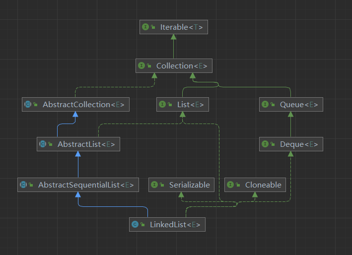

### 字符串转数组

```java
Scanner in = new Scanner(System.in);
int[] nums = Arrays.stream(in.nextLine().split(",")).mapToInt(Integer::parseInt).toArray();
```

### 泛型数组

在 Java 中，是不能直接创建泛型对象和泛型数组的。原因是 Java 有类型擦除，任何泛型类型在擦除之后就变成了 Object 类型，因此创建泛型对象就相当于创建了一个 Object 类型的对象。创建 Object
类型的对象通常没有任何意义，所以直接创建泛型对象的行为被编译器禁止。泛型数组也是一样。

正确的做法： 创建一个容积为 10 的泛型 Vector 数组

```java
private Vector<Integer>[] arr;
arr = (Vector<Integer>[]) new Vector[10];
```

### [LinkedList](https://www.jianshu.com/p/ae28d514003c)

> add和remove是一对，源自Collection；
> offer和poll是一对，源自Queue；
> push和pop是一对，源自Deque，其本质是栈（Stack类由于某些历史原因，官方已不建议使用，使用Deque代替）；
> offerFirst/offerLast和pollFirst/pollLast是一对，源自Deque，其本质是双端队列。

- Queue
    - offer； Inserts the specified element into this queue
    - poll: Retrieves and removes the head of this queue
    - peek: Retrieves, but does not remove, the head of this queue,
- Deque: A linear collection that supports element insertion and removal at both ends. The name deque is short for **"
  double ended queue"** and is usually pronounced **"deck"**.
    - push: Pushes an element onto the stack represented by this deque (in other words, at the head of this deque)
    - pop: Pops an element from the stack represented by this deque. In other words, removes and returns the first
      element of this deque.



在使用的时候，建议根据用途来使用不同的方法，比如你想把 LinkedList 当做集合 list，那么应该用 `add/remove`，如果想用作队列，则使用`offer/poll`，如果用作栈，则使用`push/pop`
，如果用作双端队列，则使用`offerFirst/offerLast/pollFirst/pollLast`

### [Convert int array to Integer array in Java](https://www.techiedelight.com/convert-int-array-integer-array-java/)

method1

```java
int[] primitiveArray = { 1, 2, 3, 4, 5 };
Integer[] boxedArray = new Integer[primitiveArray.length];
for (int i = 0; i < primitiveArray.length; i++) {
    boxedArray[i] = Integer.valueOf(primitiveArray[i]);
}
```

method2

```java
int[] primitiveArray = { 1, 2, 3, 4, 5 };
Integer[] boxedArray = Arrays.stream(primitiveArray) // IntStream
                             .boxed()                // Stream<Integer>
                             .toArray(Integer[]::new);
}
```
