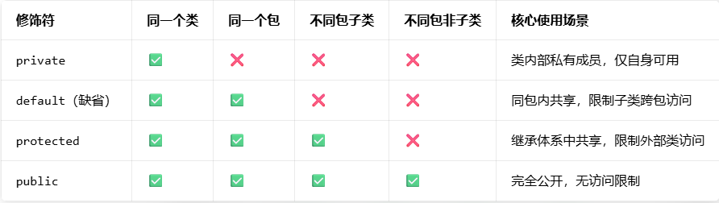

### `new Integer(123)` 与 `Integer.valueOf(123)` 的区别
`new Integer(123)` 每次都会新建一个对象，`Integer.valueOf(123)` 会使用缓存池中的对象，多次调用会取得同一个对象的引用。
```java
Integer x = new Integer(123);
Integer y = new Integer(123);
System.out.println(x == y);    // false
Integer z = Integer.valueOf(123);
Integer k = Integer.valueOf(123);
System.out.println(z == k);   // true
```


基本类型对应的缓冲池如下:
- boolean values true and false
- all byte values
- short values between -128 and 127
- int values between -128 and 127
- char in the range `\u0000` to `\u007F`

### String 
`String` 被声明为 **final**，因此它不可被继承。内部使用 char 数组存储数据，该数组被声明为 final，这意味着 value 数组初始化之后就不能再引用其它数组。并且 String 内部没有改变 value 数组的方法，因此可以保证 String 不可变。

**不可变的好处**

- 1. 可以缓存 hash 值因为 String 的 hash 值经常被使用，例如 String 用做 HashMap 的 key。不可变的特性可以使得 hash 值也不可变，因此只需要进行一次计算。
- 3. String Pool 的需要 。如果一个 String 对象已经被创建过了，那么就会从 String Pool 中取得引用。只有 String 是不可变的，才可能使用 String Pool。
- 3. 安全性String 经常作为参数，String 不可变性可以保证参数不可变。例如在作为网络连接参数的情况下如果 String 是可变的，那么在网络连接过程中，String 被改变，改变 String 对象的那一方以为现在连接的是其它主机，而实际情况却不一定是。
- 4. 线程安全String 不可变性天生具备线程安全，可以在多个线程中安全地使用。


**可变性** 

1. 可变性 String 不可变; StringBuffer 和 StringBuilder 可变.
2. 线程安全 String 不可变，因此是线程安全的; StringBuilder 不是线程安全的; StringBuffer 是线程安全的，内部使用 **synchronized** 进行同步


#### new String vs 双引号字符串
- 当创建字符串时（如 `String s = "abc"`），JVM 会先检查常量池：如果已有 "abc"，直接返回常量池中的引用；如果没有，就把 "abc" 放入常量池并返回引用。
- 而通过 `new String("abc")` 创建字符串时，会在堆内存中创建一个新对象，同时常量池也会存入 "abc"（如果没有的话），此时 `new String("abc")` 返回的是堆对象的引用，而非常量池引用。


#### `String.intern()` 方法的作用
`intern()` 是 String 类的一个本地方法（native method），核心作用是：
- 如果常量池中已经存在当前字符串的等值字符串（通过 `equals()` 判断），则返回常量池中的该字符串引用；
- 如果常量池中不存在，则将当前字符串的引用（JDK 7+）或副本（JDK 6 及以前）放入常量池，并返回该引用。
- == 比较的是引用地址，equals() 比较的是字符串内容； 经过 `intern()` 后，等值的字符串引用地址一致，== 才会返回 `true`。

简单说：`intern()` 能让堆中的字符串对象 “关联” 到常量池，实现引用复用，节省内存；适用场景是大量重复字符串的场景，避免滥用导致常量池膨胀


### jdk8 内存模型

```js
JVM 内存
├── 堆（Heap）：新生代 + 老年代 + 字符串常量池
├── 方法区（Metaspace 实现，本地内存）：类元数据 + 运行时常量池 + 静态变量
├── 虚拟机栈（线程私有）
├── 本地方法栈（线程私有）
└── 程序计数器（线程私有）
```


### `float` 与 `double`

`1.1` 字面量属于 **double** 类型，不能直接将 `1.1` 直接赋值给 **float** 变量，因为这是向下转型。Java 不能隐式执行向下转型，因为这会使得**精度降低**。

`1.1f` 字面量才是 **float** 类型。
```java
float f = 1.1f;
```

### Java 访问权限修饰符




### `equals()` 与 `==`
- 对于基本类型，== 判断两个值是否相等，基本类型没有 equals() 方法。
- 对于引用类型，== 判断两个变量是否引用同一个对象，而 equals() 判断引用的对象是否等价。


覆写 equals 方法
```java
public class EqualExample {
    private int x;
    private int y;
    private int z;

    public EqualExample(int x, int y, int z) {
        this.x = x;
        this.y = y;
        this.z = z;
    }

    @Override
    public boolean equals(Object o) {
        if (this == o) return true;
        if (o == null || getClass() != o.getClass()) return false;

        EqualExample that = (EqualExample) o;

        if (x != that.x) return false;
        if (y != that.y) return false;
        return z == that.z;
    }
}
```

### java 类初始化顺序
存在继承的情况下，初始化顺序为

- 父类(静态变量、静态语句块)
- 子类(静态变量、静态语句块)
- 父类(实例变量、普通语句块)
- 父类(构造函数)
- 子类(实例变量、普通语句块)
- 子类(构造函数)


### 反射

每个类都有一个 Class 对象，包含了与类有关的信息。当编译一个新类时，会产生一个同名的 **.class** 文件，该文件内容保存着 Class 对象。类加载相当于 Class 对象的加载。类在第一次使用时才动态加载到 JVM 中，可以使用 `Class.forName("com.mysql.jdbc.Driver")` 这种方式来控制类的加载，该方法会返回一个 Class 对象。反射可以提供运行时的类信息，并且这个类可以在运行时才加载进来，甚至在编译时期该类的 .class 不存在也可以加载进来。

**Class 和 java.lang.reflect** 一起对反射提供了支持，java.lang.reflect 类库主要包含了以下三个类:

- Field : 可以使用 get() 和 set() 方法读取和修改 Field 对象关联的字段；
- Method : 可以使用 invoke() 方法调用与 Method 对象关联的方法；
- Constructor : 可以用 Constructor 创建新的对象


### 异常 

**Throwable** 可以用来表示任何可以作为异常抛出的类，分为两种: Error 和 Exception。
其中 Error 用来表示 JVM 无法处理的错误，Exception 分为两种:
- 受检异常 : 需要用 try...catch... 语句捕获并进行处理，并且可以从异常中恢复；
- 非受检异常 : 是程序运行时错误，例如除 0 会引发 Arithmetic Exception，此时程序崩溃并且无法恢复。


