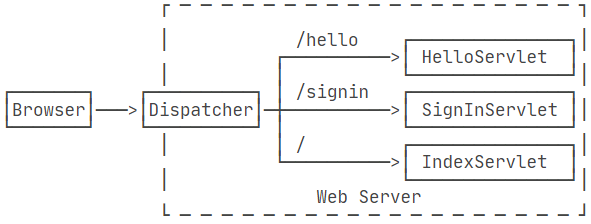
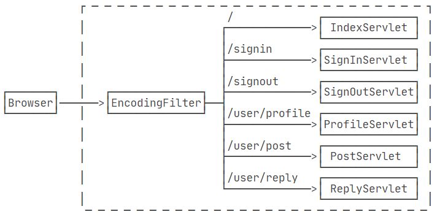
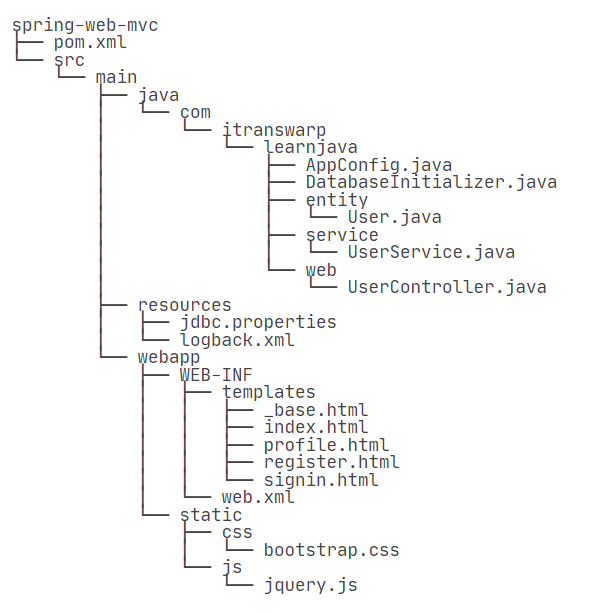
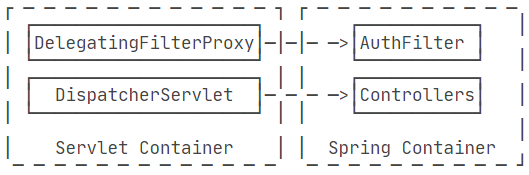
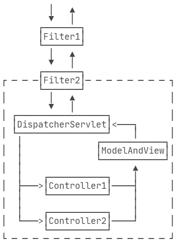
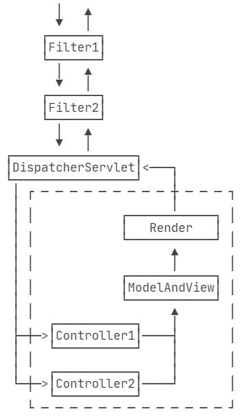

## [TCP 编程](https://www.liaoxuefeng.com/wiki/1252599548343744/1305207629676577)

Socket:一个应用程序通过一个Socket来建立一个远程连接，而Socket内部通过TCP/IP协议把数据传输到网络.Socket、TCP和部分IP的功能都是由操作系统提供的，不同的编程语言只是提供了对操作系统调用的简单的封装。

为什么需要Socket进行网络通信？因为仅仅通过IP地址进行通信是不够的，同一台计算机同一时间会运行多个网络应用程序。当操作系统接收到一个数据包的时候，如果只有IP地址，它没法判断应该发给哪个应用程序，所以，操作系统抽象出Socket接口，每个应用程序需要各自对应到不同的Socket，数据包才能根据Socket正确地发到对应的应用程序。

一个Socket就是由IP地址和端口号（范围是0～65535）组成，可以把Socket简单理解为IP地址加端口号。

使用Socket进行网络编程时，本质上就是两个进程之间的网络通信。其中一个进程必须充当服务器端，它会主动监听某个指定的端口，另一个进程必须充当客户端，它必须主动连接服务器的IP地址和指定端口，如果连接成功，服务器端和客户端就成功地建立了一个TCP连接，双方后续就可以随时发送和接收数据。

### http

HTTP是HyperText Transfer Protocol的缩写，翻译为超文本传输协议，它是基于TCP协议之上的一种请求-响应协议。

浏览器也是一种HTTP客户端，所以，客户端的HTTP编程，它的行为本质上和浏览器是一样的，即发送一个HTTP请求，接收服务器响应后，获得响应内容。只不过浏览器进一步把响应内容解析后渲染并展示给了用户，而我们使用Java进行HTTP客户端编程仅限于获得响应内容。Java标准库提供了基于HTTP的包，但是要注意，早期的JDK版本是通过HttpURLConnection访问HTTP,代码编写比较繁琐，并且需要手动处理InputStream，所以用起来很麻烦。从Java
11开始，引入了新的HttpClient，它使用链式调用的API，能大大简化HTTP的处理。

## [Servlet](https://www.liaoxuefeng.com/wiki/1252599548343744/1304265949708322)

在JavaEE平台上，处理TCP连接，解析HTTP协议这些底层工作统统扔给现成的Web服务器去做，我们只需要把自己的应用程序跑在Web服务器上。为了实现这一目的，JavaEE提供了Servlet API，我们使用Servlet
API编写自己的Servlet来处理HTTP请求，Web服务器实现Servlet API接口，实现底层功能

一个Servlet总是继承自HttpServlet，然后覆写doGet()或doPost()方法。注意到doGet()
方法传入了HttpServletRequest和HttpServletResponse两个对象，分别代表HTTP请求和响应。我们使用Servlet
API时，并不直接与底层TCP交互，也不需要解析HTTP协议，因为HttpServletRequest和HttpServletResponse就已经封装好了请求和响应

servlet程序打包类型不是jar，而是war，表示Java Web Application Archive。

普通的Java程序是通过启动JVM，然后执行main()
方法开始运行。但是Web应用程序有所不同，我们无法直接运行war文件，必须先启动Web服务器，再由Web服务器加载我们编写的HelloServlet，这样就可以让HelloServlet处理浏览器发送的请求。
我们首先要找一个支持Servlet API的Web服务器。常用的服务器有： Tomcat。

类似Tomcat这样的服务器也是Java编写的，启动Tomcat服务器实际上是启动Java虚拟机，执行Tomcat的main()
方法，然后由Tomcat负责加载我们的.war文件，并创建一个HelloServlet实例，最后以多线程的模式来处理HTTP请求。类似Tomcat这样的Web服务器也称为Servlet容器。

在Servlet中定义的实例变量会被多个线程同时访问，要注意线程安全； HttpServletRequest和HttpServletResponse实例是由Servlet容器传入的局部变量，它们只能被当前线程访问，不存在多个线程访问的问题；
在doGet()或doPost()方法中，如果使用了ThreadLocal，但没有清理，那么它的状态很可能会影响到下次的某个请求，因为Servlet容器很可能用线程池实现线程复用。



一个Web App就是由一个或多个Servlet组成的，每个Servlet通过注解说明自己能处理的路径。浏览器发出的HTTP请求总是由Web
Server先接收，然后，根据Servlet配置的映射，不同的路径转发到不同的Servlet。这种根据路径转发的功能我们一般称为Dispatch。映射到 `/` 的IndexServlet比较特殊，它实际上会接收所有未匹配的路径，相当于/*

有了HttpServletRequest和HttpServletResponse这两个高级接口，我们就不需要直接处理HTTP协议。注意到具体的实现类是由各服务器提供的，而我们编写的Web应用程序只关心接口方法，并不需要关心具体实现的子类

- 通过 HttpServletRequest 提供的接口方法可以拿到 HTTP 请求的几乎全部信息
- HttpServletResponse封装了一个HTTP响应。由于HTTP响应必须先发送Header，再发送Body，所以，操作HttpServletResponse对象时，必须先调用设置Header的方法，最后调用发送Body的方法

### Servlet多线程模型

一个Servlet类在服务器中只有一个实例，但对于每个HTTP请求，Web服务器会使用多线程执行请求。因此，一个Servlet的doGet()、doPost()
等处理请求的方法是多线程并发执行的。如果Servlet中定义了字段，要注意多线程并发访问的问题

```java
public class HelloServlet extends HttpServlet {
    private Map<String, String> map = new ConcurrentHashMap<>();
    protected void doGet(HttpServletRequest req, HttpServletResponse resp) throws ServletException, IOException {
        // 注意读写map字段是多线程并发的:
        this.map.put(key, value);
    }
}
```

对于每个请求，Web服务器会创建唯一的HttpServletRequest和HttpServletResponse实例，因此，HttpServletRequest和HttpServletResponse实例只有在当前处理线程中有效，它们总是局部变量，不存在多线程共享的问题

## [使用Filter](https://www.liaoxuefeng.com/wiki/1252599548343744/1266264823560128)

为了把一些公用逻辑从各个Servlet中抽离出来，JavaEE的Servlet规范还提供了一种Filter组件，即过滤器，它的作用是，在HTTP请求到达Servlet之前，可以被一个或多个Filter预处理，类似打印日志、登录检查等逻辑，完全可以放到Filter中。



编写一个最简单的EncodingFilter，它强制把输入和输出的编码设置为UTF-8。编写Filter时，必须实现Filter接口，在doFilter()方法内部，要继续处理请求，必须调用chain.doFilter()
。最后，用@WebFilter注解标注该Filter需要过滤的URL。这里的/*表示所有路径。

```java
@WebFilter(urlPatterns = "/*")
public class EncodingFilter implements Filter {
    public void doFilter(ServletRequest request, ServletResponse response, FilterChain chain)
            throws IOException, ServletException {
        System.out.println("EncodingFilter:doFilter");
        request.setCharacterEncoding("UTF-8");
        response.setCharacterEncoding("UTF-8");
        chain.doFilter(request, response);
    }
}
```

还可以继续添加其他Filter， 多个Filter会组成一个链，每个请求都被链上的Filter依次处理，
Servlet规范并没有对@WebFilter注解标注的Filter规定顺序。如果一定要给每个Filter指定顺序，就必须在web.xml文件中对这些Filter再配置一遍

## [为什么HttpServletRequest的输入流只能读一次](https://developer.aliyun.com/article/830227)

当我们调用 getInputStream() 方法获取输入流时得到的是一个 InputStream 对象，而实际类型是 ServletInputStream，它继承于 InputStream。 InputStream 的 read()
方法内部有一个 position，标志当前流被读取到的位置，每读取一次，该标志就会移动一次，如果读到最后，read()会返回 -1，表示已经读取完了。如果想要重新读取则需要调用 reset()
方法，position 就会移动到上次调用 mark 的位置，mark 默认是0，所以就能从头再读了。调用 reset() 方法的前提是已经重写了 reset() 方法，当然能否 reset 也是有条件的，它取决于
markSupported()
方法是否返回true。 InputStream 默认不实现 reset 的相关方法，而 ServletInputStream 也没有重写 reset 的相关方法，这样就无法重复读取流，这就是我们从 request
对象中获取的输入流就只能读取一次的原因。

## [修改请求 HttpServletRequestWrapper](https://www.liaoxuefeng.com/wiki/1252599548343744/1328976435871777)

## [修改响应 HttpServletResponseWrapper](https://www.liaoxuefeng.com/wiki/1252599548343744/1328976456843298)

## [使用Listener](https://www.liaoxuefeng.com/wiki/1252599548343744/1304266123771937)

Listener顾名思义就是监听器，有好几种Listener，其中最常用的是ServletContextListener,通过Listener我们可以监听Web应用程序的生命周期

任何标注为@WebListener，且实现了特定接口的类会被Web服务器自动初始化,它会在整个Web应用程序初始化完成后，以及Web应用程序关闭后获得回调通知。

## ioc 容器

在 application.xml 中配置 bean 依赖关系

```xml

<beans xmlns="http://www.springframework.org/schema/beans">
    <bean id="userService" class="com.learnJava.service.UserService">
        <property name="mailService" ref="mailService"/>
    </bean>
    <bean id="mailService" class="com.learnJava.service.MailService"/>
</beans>
```

在入口函数中加载 application.xml， Spring容器会为我们创建并装配好配置文件中指定的所有Bean， 接下来就可以从Spring容器中“取出”装配好的Bean然后使用它

```java
public class Main {
    public static void main(String[] args) {
        ApplicationContext context = new ClassPathXmlApplicationContext("application.xml");
        UserService userService = context.getBean(UserService.class);
        User user = userService.login("bob@example.com", "password");
        System.out.println(user.getName());
    }
}
```

Spring容器就是 ApplicationContext，它是一个接口，有很多实现类，这里我们选择 ClassPathXmlApplicationContext，表示它会自动从 classpath 中查找指定的XML配置文件

Spring还提供另一种IoC容器叫BeanFactory，使用方式和ApplicationContext类似：

```java
BeanFactory factory = new XmlBeanFactory(new ClassPathResource("application.xml"));
MailService mailService = factory.getBean(MailService.class);
```

BeanFactory 和 ApplicationContext 的区别在于，BeanFactory 的实现是按需创建，即第一次获取 Bean 时才创建这个Bean，而 ApplicationContext 会一次性创建所有的 Bean

## Annotation配置

使用Spring的IoC容器，实际上就是通过类似XML这样的配置文件，把我们自己的Bean的依赖关系描述出来，然后让容器来创建并装配Bean。一旦容器初始化完毕，我们就直接从容器中获取Bean使用它们。 使用 XML
配置的优点是所有的Bean都能一目了然地列出来，并通过配置注入能直观地看到每个Bean的依赖。它的缺点是写起来非常繁琐，每增加一个组件，就必须把新的Bean配置到XML中.

**为了解决这个问题，我们可以使用Annotation配置，可以完全不需要XML，让Spring自动扫描Bean并组装它们。**

- 每个Bean被标注为@Component并正确使用@Autowired注入；
- 配置类被标注为@Configuration和@ComponentScan；
- 所有Bean均在指定包以及子包内

## [定制bean](https://www.liaoxuefeng.com/wiki/1252599548343744/1308043627200545)

- 对于Spring容器来说，当我们把一个Bean标记为@Component后，它就会自动为我们创建一个单例（Singleton），即容器初始化时创建Bean，容器关闭前销毁Bean。在容器运行期间，我们调用getBean(Class)
  获取到的Bean总是同一个实例。

- 还有一种Bean，我们每次调用getBean(Class)
  ，容器都返回一个新的实例，这种Bean称为Prototype（原型），它的生命周期显然和Singleton不同。声明一个Prototype的Bean时，需要添加一个额外的@Scope注解
- 注入List ： 有些时候，我们会有一系列接口相同，不同实现的 Bean, 比如我们有一个 Validator 接口，它有3个实现类，分别是 EmailValidator、PasswordValidator、NameValidator。
  Spring会自动把所有类型为Validator的Bean装配为一个List注入进来，这样一来，我们每新增一个Validator类型，就自动被Spring装配到Validators中了，非常方便

```java
@Component
public class Validators {
    @Autowired
    List<Validator> validators;

    public void validate(String email, String password, String name) {
        for (var validator : this.validators) {
            validator.validate(email, password, name);
        }
    }
}
```

- 创建第三方Bean ，如果一个Bean不在我们自己的package管理之内，我们自己在@Configuration类中编写一个Java方法创建并返回它，注意给方法标记一个@Bean注解
  ，Spring对标记为@Bean的方法只调用一次，因此返回的Bean仍然是单例。

- 初始化和销毁 有些时候，一个Bean在注入必要的依赖后，需要进行初始化（监听消息等）。在容器关闭时，有时候还需要清理资源（关闭连接池等）。我们通常会定义一个init()方法进行初始化，定义一个shutdown()
  方法进行清理，然后，引入JSR-250定义的Annotation(一个jar包)，在Bean的初始化和清理方法上标记@PostConstruct和@PreDestroy，Spring容器会对上述Bean做如下初始化流程：
  调用构造方法创建实例； 根据@Autowired进行注入； 调用标记有@PostConstruct的init()方法进行初始化。 而销毁时，容器会首先调用标记有@PreDestroy的shutdown()方法

```java
@Component
public class MailService {
    @Autowired(required = false)
    ZoneId zoneId = ZoneId.systemDefault();

    @PostConstruct
    public void init() {
        System.out.println("Init mail service with zoneId = " + this.zoneId);
    }

    @PreDestroy
    public void shutdown() {
        System.out.println("Shutdown mail service");
    }
}
```

- 使用别名:
  默认情况下，对一种类型的Bean，容器只创建一个实例。但有些时候，我们需要对一种类型的Bean创建多个实例。例如，同时连接多个数据库，就必须创建多个DataSource实例。这个时候，需要给每个Bean添加不同的名字,或者把其中某个Bean指定为@Primary，这样，在注入时，如果没有指出Bean的名字，Spring会注入标记有@Primary的Bean

-

使用条件装配：Spring为应用程序准备了Profile这一概念，用来表示不同的环境。创建某个Bean时，Spring容器可以根据注解@Profile来决定是否创建。Spring还可以根据@Conditional决定是否创建某个Bean。

## AOP

AOP是Aspect Oriented Programming，即面向切面编程。而AOP是一种新的编程方式，它和OOP不同.

在Java平台上，对于AOP的织入，有3种方式：

编译期：在编译时，由编译器把切面调用编译进字节码，这种方式需要定义新的关键字并扩展编译器，AspectJ就扩展了Java编译器，使用关键字aspect来实现织入；

类加载器：在目标类被装载到JVM时，通过一个特殊的类加载器，对目标类的字节码重新“增强”；

运行期：目标对象和切面都是普通Java类，通过JVM的动态代理功能或者第三方库实现运行期动态织入。

最简单的方式是第三种，Spring的AOP实现就是基于JVM的动态代理。由于JVM的动态代理要求必须实现接口，如果一个普通类没有业务接口，就需要通过CGLIB或者Javassist这些第三方库实现。

AOP技术看上去比较神秘，但实际上，它本质就是一个动态代理，让我们把一些常用功能如权限检查、日志、事务等，从每个业务方法中剥离出来。

## JDBC

Java为关系数据库定义了一套标准的访问接口：JDBC（Java Database，在Java的标准库java.sql
Connectivity）,使用Java程序访问数据库时，Java代码并不是直接通过TCP连接去访问数据库，而是通过JDBC接口来访问，而JDBC接口则通过JDBC驱动来实现真正对数据库的访问。我们把某个数据库实现了JDBC接口的jar包称为JDBC驱动

例如，我们在Java代码中如果要访问MySQL，那么必须编写代码操作JDBC接口。注意到JDBC接口是Java标准库自带的，所以可以直接编译。而具体的JDBC驱动是由数据库厂商提供的，例如，MySQL的JDBC驱动由Oracle提供。因此，访问某个具体的数据库，我们只需要引入该厂商提供的JDBC驱动，就可以通过JDBC接口来访问，这样保证了Java程序编写的是一套数据库访问代码，却可以访问各种不同的数据库，因为他们都提供了标准的JDBC驱动。从代码来看，Java标准库自带的JDBC接口其实就是定义了一组接口，而某个具体的JDBC驱动其实就是实现了这些接口的类

实际上，一个MySQL的JDBC的驱动就是一个jar包，它本身也是纯Java编写的。我们自己编写的代码只需要引用Java标准库提供的java.sql包下面的相关接口，由此再间接地通过MySQL驱动的jar包通过网络访问MySQL服务器，所有复杂的网络通讯都被封装到JDBC驱动中，因此，Java程序本身只需要引入一个MySQL驱动的jar包就可以正常访问MySQL服务器

### JDBC连接

使用JDBC时，我们先了解什么是Connection。Connection代表一个JDBC连接，它相当于Java程序到数据库的连接（通常是TCP连接）。打开一个Connection时，需要准备URL、用户名和口令，才能成功连接到数据库。
URL是由数据库厂商指定的格式

例如，MySQL的URL是： `jdbc:mysql://<hostname>:<port>/<db>?key1=value1&key2=value2`

数据库操作总结起来就四个字：增删改查，行话叫CRUD：Create，Retrieve，Update和Delete。

在执行JDBC的增删改查的操作时，如果每一次操作都来一次打开连接，操作，关闭连接，那么创建和销毁JDBC连接的开销就太大了。为了避免频繁地创建和销毁JDBC连接，我们可以通过连接池（Connection
Pool）复用已经创建好的连接。JDBC连接池有一个标准的接口javax.sql.DataSource，注意这个类位于Java标准库中，但仅仅是接口。要使用JDBC连接池，我们必须选择一个JDBC连接池的实现。常用的JDBC连接池有：HikariCP,
C3P0, BoneCP, Druid

### [spring with jdbc](https://www.liaoxuefeng.com/wiki/1252599548343744/1282383699509281)

在Spring使用JDBC，首先我们通过IoC容器创建并管理一个DataSource实例，然后，Spring提供了一个JdbcTemplate，可以方便地让我们操作JDBC，因此，通常情况下，我们会实例化一个JdbcTemplate。顾名思义，这个类主要使用了Template模式。
需要强调的是，JdbcTemplate只是对JDBC操作的一个简单封装，它的目的是尽量减少手动编写try(resource) {...}的代码，对于查询，主要通过RowMapper实现了JDBC结果集到Java对象的转换。

- 针对简单查询，优选query()和queryForObject()，因为只需提供SQL语句、参数和RowMapper；
- 针对更新操作，优选update()，因为只需提供SQL语句和参数；
- 任何复杂的操作，最终也可以通过execute(ConnectionCallback)实现，因为拿到Connection就可以做任何JDBC操作

```java
jdbcTemplate.execute()
jdbcTemplate.update()
jdbcTemplate.query()
jdbcTemplate.queryForObject
```

Spring提供了一个PlatformTransactionManager来表示事务管理器，所有的事务都由它负责管理。而事务由TransactionStatus表示。Spring为啥要抽象出PlatformTransactionManager和TransactionStatus？原因是JavaEE除了提供JDBC事务外，它还支持分布式事务JTA（Java
Transaction API）。分布式事务是指多个数据源（比如多个数据库，多个消息系统）要在分布式环境下实现事务的时候，应该怎么实现。

一般我们的代码只需要JDBC事务，因此，在AppConfig中，需要再定义一个PlatformTransactionManager对应的Bean，它的实际类型是DataSourceTransactionManager，使用编程的方式使用Spring事务仍然比较繁琐，更好的方式是通过声明式事务来实现。使用声明式事务非常简单，除了在AppConfig中追加一个上述定义的PlatformTransactionManager外，再加一个@EnableTransactionManagement就可以启用声明式事务。然后，对需要事务支持的方法，加一个@Transactional注解，或者更简单一点，直接class处加上@Transactional，表示所有public方法都具有事务支持
默认情况下，如果发生了RuntimeException，Spring的声明式事务将自动回滚。在一个事务方法中，如果程序判断需要回滚事务，只需抛出RuntimeException

Spring的声明式事务为事务传播定义了几个级别，默认传播级别就是 REQUIRED，它的意思是，如果当前没有事务，就创建一个新事务，如果当前有事务，就加入到当前事务中执行。REQUIRED级别基本上满足绝大部分的需求

Spring对一个声明式事务的方法，如何开启事务支持？原理仍然是AOP代理，即通过自动创建Bean的Proxy实现

Spring使用声明式事务，最终也是通过执行JDBC事务来实现功能的，那么，一个事务方法，如何获知当前是否存在事务？

答案是使用ThreadLocal。Spring总是把JDBC相关的Connection和TransactionStatus实例绑定到ThreadLocal。如果一个事务方法从ThreadLocal未取到事务，那么它会打开一个新的JDBC连接，同时开启一个新的事务，否则，它就直接使用从ThreadLocal获取的JDBC连接以及TransactionStatus。
因此，事务能正确传播的前提是，方法调用是在一个线程内才行。

事务只能在当前线程传播，无法跨线程传播。
那如果我们想实现跨线程传播事务呢？原理很简单，就是要想办法把当前线程绑定到ThreadLocal的Connection和TransactionStatus实例传递给新线程，但实现起来非常复杂，根据异常回滚更加复杂，不推荐自己去实现。

### 使用DAO

编写数据访问层的时候，可以使用DAO模式。DAO即Data Access
Object的缩写。Spring提供了一个JdbcDaoSupport类，用于简化DAO的实现。这个JdbcDaoSupport没什么复杂的，核心代码就是持有一个JdbcTemplate

### ORM

这种把关系数据库的表记录映射为Java对象的过程就是ORM：Object-Relational Mapping。ORM既可以把记录转换成Java对象，也可以把Java对象转换为行记录。
使用JdbcTemplate配合RowMapper可以看作是最原始的ORM。如果要实现更自动化的ORM，可以选择成熟的ORM框架,比如：Hibernate

myBatis:介于全自动ORM如Hibernate和手写全部如JdbcTemplate之间，还有一种半自动的ORM，它只负责把ResultSet自动映射到Java Bean，或者自动填充Java
Bean参数，但仍需自己写出SQL。MyBatis就是这样一种半自动化ORM框架.

ORM的设计套路都是类似的。使用MyBatis的核心就是创建SqlSessionFactory，这里我们需要创建的是SqlSessionFactoryBean.和Hibernate不同的是，MyBatis使用Mapper来实现映射，而且Mapper必须是接口。这里的Mapper不是JdbcTemplate的RowMapper的概念，它是定义访问users表的接口方法。比如我们定义了一个`User getById(long)`
的主键查询方法，不仅要定义接口方法本身，还要明确写出查询的SQL，这里用注解@Select标记。SQL语句的任何参数，都与方法参数按名称对应。例如，方法参数id的名字通过注解@Param()
标记为id，则SQL语句里将来替换的占位符就是#{id}。

```java
public interface UserMapper {
	@Select("SELECT * FROM users WHERE id = #{id}")
	User getById(@Param("id") long id);
}
```

有了UserMapper接口，还需要对应的实现类 UserMapperImp
才能真正执行这些数据库操作的方法。虽然可以自己写实现类，但我们除了编写UserMapper接口外，还有BookMapper、BonusMapper……一个一个写太麻烦，因此，MyBatis提供了一个MapperFactoryBean来自动创建所有Mapper的实现类。可以用一个简单的注解来启用它 `@MapperScan("com.itranswarp.learnjava.mapper")`
。有了@MapperScan，就可以让MyBatis自动扫描指定包的所有Mapper并创建实现类。在真正的业务逻辑中，我们可以直接注入

XML配置 :
上述在Spring中集成MyBatis的方式，我们只需要用到注解，并没有任何XML配置文件。MyBatis也允许使用XML配置映射关系和SQL语句,编写XML配置的优点是可以组装出动态SQL，并且把所有SQL操作集中在一起。缺点是配置起来太繁琐，调用方法时如果想查看SQL还需要定位到XML配置中

使用MyBatis最大的问题是所有SQL都需要全部手写，优点是执行的SQL就是我们自己写的SQL，对SQL进行优化非常简单，也可以编写任意复杂的SQL，或者使用数据库的特定语法，但切换数据库可能就不太容易。好消息是大部分项目并没有切换数据库的需求，完全可以针对某个数据库编写尽可能优化的SQL。

## springMVC 项目结构



其中，src/main/webapp是标准web目录，WEB-INF存放web.xml，编译的class，第三方jar，以及不允许浏览器直接访问的View模版，static目录存放所有静态文件。
在src/main/resources目录中存放的是Java程序读取的classpath资源文件

## [使用Spring MVC](https://www.liaoxuefeng.com/wiki/1252599548343744/1282383921807393)

Servlet容器为每个Web应用程序自动创建一个唯一的ServletContext实例，这个实例就代表了Web应用程序本身.

- Spring提供的是一个IoC容器，所有的Bean，包括Controller，都在Spring
  IoC容器中被初始化，而Servlet容器由JavaEE服务器提供（如Tomcat），Servlet容器对Spring一无所知，他们之间到底依靠什么进行联系，又是以何种顺序初始化的？ web.xml 是java web
  项目的一个重要的配置文件，但是web.xml文件并不是Java
  web工程必须的。web.xml可以定制servlet、JSP、Context的初始化参数，然后可以再servlet、JSP、Context中获取这些参数值,依次启动servlet和ioc容器

- 和普通Spring配置一样，我们编写正常的AppConfig后，只需加上@EnableWebMvc注解，就“激活”了Spring
  MVC,除了创建DataSource、JdbcTemplate、PlatformTransactionManager外，AppConfig需要额外创建几个用于Spring MVC的Bean

- 使用@RestController可以方便地编写REST服务，Spring默认使用JSON作为输入和输出。 要控制序列化和反序列化，可以使用Jackson提供的@JsonIgnore和@JsonProperty注解。

- springMVC的controller方法中如果参数需要传入HttpServletRequest、HttpServletResponse或者HttpSession，直接添加这个类型的参数即可，Spring MVC会自动按类型传入

- 处理CORS：在WebMvcConfigurer中定义一个全局CORS配置


-

异步处理：在Servlet模型中，每个请求都是由某个线程处理，然后，将响应写入IO流，发送给客户端。从开始处理请求，到写入响应完成，都是在同一个线程中处理的。这种线程模型非常重要，因为Spring的JDBC事务是基于ThreadLocal实现的，
如果在处理过程中，一会由线程A处理，一会又由线程B处理，那事务就全乱套了。此外，很多安全认证，也是基于ThreadLocal实现的，可以保证在处理请求的过程中，各个线程互不影响。但是，如果一个请求处理的时间较长，例如几秒钟甚至更长，那么，这种基于线程池的同步模型很快就会把所有线程耗尽，导致服务器无法响应新的请求。如果把长时间处理的请求改为异步处理，那么线程池的利用率就会大大提高。Servlet从3.0规范开始添加了异步支持，允许对一个请求进行异步处理。第一种async处理方式是返回一个Callable，Spring
MVC自动把返回的Callable放入线程池执行，等待结果返回后再写入响应。第二种async处理方式是返回一个DeferredResult对象，然后在另一个线程中，设置此对象的值并写入响应。
在实际使用时，经常用到的就是DeferredResult，因为返回DeferredResult时，可以设置超时、正常结果和错误结果，易于编写比较灵活的逻辑。
使用async异步处理响应时，要时刻牢记，在另一个异步线程中的事务和Controller方法中执行的事务不是同一个事务，在Controller中绑定的ThreadLocal信息也无法在异步线程中获取。

- Servlet
  3.0规范添加的异步支持是针对同步模型打了一个“补丁”，虽然可以异步处理请求，但高并发异步请求时，它的处理效率并不高，因为这种异步模型并没有用到真正的“原生”异步。Java标准库提供了封装操作系统的异步IO包java.nio，是真正的多路复用IO模型，可以用少量线程支持大量并发。使用NIO编程复杂度比同步IO高很多，因此我们很少直接使用NIO。相反，大部分需要高性能异步IO的应用程序会选择Netty这样的框架，它基于NIO提供了更易于使用的API，方便开发异步应用程序。
-

WebSocket：WebSocket是一种基于HTTP的长链接技术。传统的HTTP协议是一种请求-响应模型，如果浏览器不发送请求，那么服务器无法主动给浏览器推送数据。HTTP本身是基于TCP连接的，所以，WebSocket在HTTP协议的基础上做了一个简单的升级，即建立TCP连接后，浏览器发送请求时，附带几个头：`Upgrade: websocket`
,就表示客户端希望升级连接，变成长连接的WebSocket，服务器返回升级成功的响应。收到成功响应后表示WebSocket“握手”成功，这样，代表WebSocket的这个TCP连接将不会被服务器关闭，而是一直保持，服务器可随时向浏览器推送消息，浏览器也可随时向服务器推送消息。双方推送的消息既可以是文本消息，也可以是二进制消息，一般来说，绝大部分应用程序会推送基于JSON的文本消息。

### [SpringMvc中使用 Filter](https://www.liaoxuefeng.com/wiki/1252599548343744/1282384114745378)

Servlet容器实例化的Filter，间接引用Spring容器实例化的AuthFilter。Spring
MVC提供了一个DelegatingFilterProxy，专门来干这个事情。Servlet容器从web.xml中读取配置，实例化DelegatingFilterProxy，注意命名是authFilter；
Spring容器通过扫描@Component实例化AuthFilter。
当DelegatingFilterProxy生效后，它会自动查找注册在ServletContext上的Spring容器，再试图从容器中查找名为authFilter的Bean，也就是我们用@Component声明的AuthFilter



### [SpringMvc中使用 Interceptor](https://www.liaoxuefeng.com/wiki/1252599548343744/1347180610715681)

Filter由Servlet容器管理，它在Spring MVC的Web应用程序中作用范围如下



如果只基于Spring MVC开发应用程序，还可以使用Spring
MVC提供的一种功能类似Filter的拦截器：Interceptor。和Filter相比，Interceptor拦截范围不是后续整个处理流程，而是仅针对Controller拦截，所以，Interceptor
的拦截范围其实就是Controller方法，它实际上就相当于基于AOP的方法拦截。使用Interceptor的好处是Interceptor本身是Spring管理的Bean，因此注入任意Bean都非常简单。



此外，可以应用多个Interceptor，并通过简单的@Order指定顺序。一个Interceptor必须实现HandlerInterceptor接口，可以选择实现preHandle()
、postHandle()和afterCompletion()方法。preHandle()是Controller方法调用前执行，postHandle()是Controller方法正常返回后执行，而afterCompletion()
无论Controller方法是否抛异常都会执行，参数ex就是Controller方法抛出的异常（未抛出异常是null）。 在preHandle()
中，也可以直接处理响应，然后返回false表示无需调用Controller方法继续处理了，通常在认证或者安全检查失败时直接返回错误响应。在postHandle()
中，因为捕获了Controller方法返回的ModelAndView，所以可以继续往ModelAndView里添加一些通用数据，很多页面需要的全局数据如Copyright信息等都可以放到这里，无需在每个Controller方法中重复添加。

最后，要让拦截器生效，我们在WebMvcConfigurer中注册所有的Interceptor

```java
@Bean
WebMvcConfigurer createWebMvcConfigurer(@Autowired HandlerInterceptor[] interceptors) {
    return new WebMvcConfigurer() {
        public void addInterceptors(InterceptorRegistry registry) {
            for (var interceptor : interceptors) {
                registry.addInterceptor(interceptor);
            }
        }
    };
}
```

## springBoot

- `application.yml` : 这是Spring Boot默认的配置文件，它采用YAML格式而不是.properties格式，文件名必须是application.yml而不是其他名称。

- `logback-spring.xml`:这是Spring Boot的logback配置文件名称。

- 使用Spring Boot时，强烈推荐从spring-boot-starter-parent继承，因为这样就可以引入Spring Boot的预置配置。
  紧接着，我们引入了依赖spring-boot-starter-web和spring-boot-starter-jdbc，它们分别引入了Spring MVC相关依赖和Spring
  JDBC相关依赖，无需指定版本号，因为引入的`<parent>`内已经指定了，只有我们自己引入的某些第三方jar包需要指定版本号。

- springMvc中我们定义的数据源、声明式事务、JdbcTemplate在哪创建的？这些自动创建的Bean就是Spring Boot的特色：AutoConfiguration。
  当我们引入spring-boot-starter-jdbc时，启动时会自动扫描所有的XxxAutoConfiguration。`DataSourceAutoConfiguration`
  ：自动创建一个DataSource，其中配置项从application.yml的spring.datasource读取；`DataSourceTransactionManagerAutoConfiguration`
  ：自动创建了一个基于JDBC的事务管理器；`JdbcTemplateAutoConfiguration`：自动创建了一个JdbcTemplate。 因此，我们自动得到了一个
  DataSource、一个DataSourceTransactionManager和一个JdbcTemplate。Spring
  Boot大量使用XxxAutoConfiguration来使得许多组件被自动化配置并创建，而这些创建过程又大量使用了Spring的Conditional功能。

- Spring Boot自动装配功能是通过自动扫描+条件装配实现的，这一套机制在默认情况下工作得很好，但是，如果我们要手动控制某个Bean的创建，就需要详细地了解Spring
  Boot自动创建的原理，很多时候还要跟踪XxxAutoConfiguration，以便设定条件使得某个Bean不会被自动创建。

- 禁用自动配置：Spring
  Boot大量使用自动配置和默认配置，极大地减少了代码，通常只需要加上几个注解，并按照默认规则设定一下必要的配置即可。例如，配置JDBC，默认情况下，只需要配置一个spring.datasource。有时候，我们又必须要禁用某些自动配置。例如，系统有主从两个数据库，而Spring
  Boot的自动配置只能配一个，怎么办？ 这个时候，针对DataSource相关的自动配置，就必须关掉。我们需要用exclude指定需要关掉的自动配置

```java
@SpringBootApplication
// 启动自动配置，但排除指定的自动配置:
@EnableAutoConfiguration(exclude = DataSourceAutoConfiguration.class)
public class Application {
    ...
}
```

### [RedisAutoConfiguration 类](https://blog.csdn.net/weixin_48420669/article/details/108087306)

```java

@Configuration // 表明这是一个配置类
// 表明类路径下有RedisOperations这个类的时候该类才会被加载到容器中（RedisTemplate extends RedisOperations）
@ConditionalOnClass(RedisOperations.class)
@EnableConfigurationProperties(RedisProperties.class) // 表示让RedisProperties配置类生效
@Import({ LettuceConnectionConfiguration.class, JedisConnectionConfiguration.class }) // 最后又导入了两个redis连接类
public class RedisAutoConfiguration {
    // // 定义 bean RedisTemplate redisTemplate (仅在该 bean 不存在的情况下才定义)
	@Bean
	@ConditionalOnMissingBean(name = "redisTemplate")
	public RedisTemplate<Object, Object> redisTemplate(
			RedisConnectionFactory redisConnectionFactory) throws UnknownHostException {
		RedisTemplate<Object, Object> template = new RedisTemplate<>();
		template.setConnectionFactory(redisConnectionFactory);
		return template;
	}
    // 定义 bean StringRedisTemplate  stringRedisTemplate (仅在该 bean 不存在的情况下才定义)
	@Bean
	@ConditionalOnMissingBean
	public StringRedisTemplate stringRedisTemplate(
			RedisConnectionFactory redisConnectionFactory) throws UnknownHostException {
		StringRedisTemplate template = new StringRedisTemplate();
		template.setConnectionFactory(redisConnectionFactory);
		return template;
	}

}

```

### [@Autowired和@Resource](https://juejin.cn/post/7022507865701089317)

- @Resource和@Autowired都可以作为注入属性的修饰，在接口仅有单一实现类时，两个注解的修饰效果相同，可以互相替换，不影响使用
- @Resource是JDK原生的注解，@Autowired是Spring2.5 引入的注解
-

@Resource有两个属性name和type。Spring将@Resource注解的name属性解析为bean的名字，而type属性则解析为bean的类型。所以如果使用name属性，则使用byName的自动注入策略，而使用type属性时则使用byType自动注入策略。如果既不指定name也不指定type属性，这时将通过反射机制使用byName自动注入策略。

- @Autowired只根据type进行注入，不会去匹配name。如果涉及到type无法辨别注入对象时，那需要依赖@Qualifier或@Primary注解一起来修饰。

### [springBoot cache](https://zhuanlan.zhihu.com/p/266804094?utm_id=0)

- java项目添加 maven 依赖 `spring-boot-starter-cache`
- 在启动类加上 @EnableCaching 注解即可开启使用缓存
- 在要缓存的方法上面添加 @Cacheable 注解，即可缓存这个方法的返回值
- Spring Cache有几个常用注解，分别为 @Cacheable、@CachePut、@CacheEvict、@Caching、 @CacheConfig。除了最后一个 @CacheConfig
  外，其余四个都可以用在类上或者方法级别上，如果用在类上，就是对该类的所有 public 方法生效
- @Cacheable
  @Cacheble注解表示这个方法有了缓存的功能，方法的返回值会被缓存下来，下一次调用该方法前，会去检查是否缓存中已经有值，如果有就直接返回，不调用方法。如果没有，就调用方法，然后把结果缓存起来。这个注解一般用在查询方法上
- @CachePut 加了@CachePut注解的方法，会把方法的返回值put到缓存里面缓存起来，供其它地方使用。它通常用在新增方法上
- @CacheEvict 使用了 CacheEvict 注解的方法，会清空指定缓存。一般用在更新或者删除的方法上。
- @CacheConfig 前面提到的四个注解，都是Spring
  Cache常用的注解。但这几个注解通常都是作用在方法上的，而有些配置可能又是一个类通用的，这种情况就可以使用@CacheConfig了，它是一个类级别的注解，可以在类级别上配置cacheNames、keyGenerator、cacheManager、cacheResolver等。
- SpringBoot 默认使用基于ConcurrentHashMap的缓存， 如果要使用其它的缓存框架，我们只需要重新定义好CacheManager和CacheResolver这两个Bean就行了。
  事实上，Spring会自动检测我们是否引入了相应的缓存框架，如果我们引入了spring-data-redis，Spring就会自动使用spring-data-redis提供的RedisCacheManager，RedisCache

### @EnableWebMvc 注解

- @EnableWebMvc的意义: Adding this annotation to an @Configuration class imports the Spring MVC configuration
  from `WebMvcConfigurationSupport`, 在 WebMvcConfigurationSupport 中注册了许多的 `HandlerMappings`(映射相应的 request 到相应的 handler
  methods)
- `org.springframework.web.servlet.config.annotation.WebMvcConfigurer`: spring webMvc 配置类，如果要自定义 webMvc,需要 override
  这个类的方法

### CommandLineRunner 接口

Spring boot的CommandLineRunner接口主要用于实现在应用初始化后，去执行一段代码块逻辑，这段初始化代码在整个应用生命周期内只会执行一次,我们可以在run()方法里使用任何依赖，因为它们已经初始化好了

### springBoot 自定义错误处理

- @RestControllerAdvice ：@ControllerAdvice 和 @ResponseBody 的组合
- @ControllerAdvice :  Specialization of @Component for classes that declare @ExceptionHandler, @InitBinder, or
  @ModelAttribute methods to be shared across multiple @Controller classes
- ExceptionHandler : Annotation for handling exceptions in specific handler classes and/or handler methods.

```java
@RestControllerAdvice
public class BusinessExceptionHandler {

    @ExceptionHandler(NullPointerException.class)
    public RestResponse handleNullPointerException(HttpServletRequest request, NullPointerException e) {
        e.printStackTrace();
        return RestResponse.error("NullPointerException");
    }
    
}
```

### ApplicationContextAware 接口

Aware 是一个标记接口，没有方法，ApplicationContextAware 接口扩展了该标记接口，定义了 setApplicationContext 回调方法，并传入 ApplicationContext
作为参数，以便获取应用上下文，实现 ApplicationContextAware 的类，spring 会回调 setApplicationContext 方法，暴露出上下文环境

- Aware：A marker superinterface indicating that a bean is eligible to be notified by the Spring container of a
  particular framework object through a callback-style method. The actual method signature is determined by individual
  subinterfaces but should typically consist of just one void-returning method that accepts a single argument.

- 上下文环境中可以获取 BeanFactory , 用以获取所有由 spring 管理的 Bean

```java
@Component
public class SpringUtils implements ApplicationContextAware {

    private static ApplicationContext applicationContext;
    // 这个 setApplicationContext 方法会被自主调用
    @Override
    public void setApplicationContext(ApplicationContext applicationContext) throws BeansException {
        SpringUtils.applicationContext = applicationContext;
    }

    public static ApplicationContext getApplicationContext() {
        return applicationContext;
    }

    public static <T> T getBean(Class<T> clazz) {
        return getApplicationContext().getBean(clazz);
    }
}
```
### springBoot中使用Filter

添加Filter:我们在Spring中已经学过了集成Filter，本质上就是通过代理，把Spring管理的Bean注册到Servlet容器中，不过步骤比较繁琐，需要配置web.xml。在Spring
Boot中，添加一个Filter更简单了，可以做到零配置.Spring Boot会自动扫描所有的FilterRegistrationBean类型的Bean，然后，将它们返回的Filter自动注册到Servlet容器中，无需任何配置。

```java
@Component
public class AuthFilterRegistrationBean extends FilterRegistrationBean<Filter> {
    @Autowired
    UserService userService;

    @Override
    public Filter getFilter() {
        setOrder(10);
        return new AuthFilter();
    }

    class AuthFilter implements Filter {
        ...
    }
}
```
