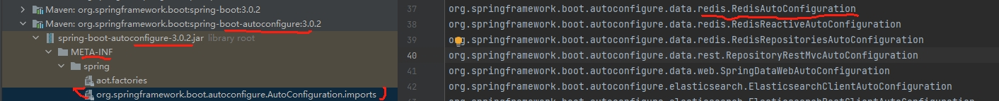

### FAQ

- [使用SpringBoot时关于静态资源的访问问题](https://www.jianshu.com/p/5f5b82e7ee23)

```shell
# 项目路径
server.servlet.context-path=/test-demo
# 静态资源配置
spring.mvc.static-path-pattern=/static/**

# 访问地址 http://server:port/test-demo/static/xxx.jpg
```

- [解决决SpringBoot图片上传需重启服务器才能显示的问题](https://blog.csdn.net/qq_49137582/article/details/123601007)

```java
// 前端页面实现头像图片上传并实时更新显示的功能，但是文件上传成功后不能实时显示，必须重启服务器后才能显示出来
// 这是服务器的自我保护机制，为了防止暴露绝对路径
@Configuration
public class ImageUploadConfig implements WebMvcConfigurer {
        @Override
        public void addResourceHandlers(ResourceHandlerRegistry registry) {
        registry.addResourceHandler("/static/images/upload/**").addResourceLocations("file:E:\\Allworkspaces\\idea-workspace\\SpringBoot\\store\\src\\main\\resources\\static\\images\\upload\\");
    }
}
```

- mybatis sql 日志打印
    - mybatis/mybatis-plus 日志打印配置：这两个需要通过配置 [mybatis日志输出](https://mybatis.org/mybatis-3/zh/logging.html)
      ,或者配置 [mybatis-plus](https://baomidou.com/pages/f84a74/#%E5%90%AF%E5%8A%A8-mybatis-%E6%9C%AC%E8%BA%AB%E7%9A%84-log-%E6%97%A5%E5%BF%97)
      日志输出，最终都是配置 mybatis
      来输出日志，详细的配置可以参考 [How Does Mybatis-Plus Print SQL Logs and Parameters To The Log File Under SpringBoot](https://medium.com/illumination/how-does-mybatis-plus-print-sql-logs-and-parameters-to-the-log-file-under-springboot-d9573c30f9e6)

```yaml
#springBoot mybatis-plus配置
logging.level.com.baomidou.mybatisplus=DEBUG
  #Project mapper directory
logging.level.com.dragonsoft.demojar.mapper=DEBUG
mybatis-plus.configuration.log-impl=org.apache.ibatis.logging.slf4j.Slf4jImpl
```

- [Show Hibernate/JPA SQL Statements from Spring Boot](https://www.baeldung.com/sql-logging-spring-boot)
    - Spring Data JDBC,Java为关系数据库定义了一套标准的访问接口：`JDBC（Java Database Connectivity）`
      ,JDBC接口是Java标准库自带的,可以直接编译,具体的JDBC驱动是由数据库厂商提供的，例如，MySQL的JDBC驱动由Oracle提供。因此，访问某个具体的数据库，我们只需要引入该厂商提供的JDBC驱动，就可以通过JDBC接口来访问，这样保证了Java程序编写的是一套数据库访问代码，却可以访问各种不同的数据库，因为他们都提供了标准的JDBC驱动.实际上，一个MySQL的JDBC的驱动就是一个jar包，它本身也是纯Java编写的。我们自己编写的代码只需要引用Java标准库提供的java.sql包下面的相关接口，由此再间接地通过MySQL驱动的jar包通过网络访问MySQL服务器，所有复杂的网络通讯都被封装到JDBC驱动中，因此，Java程序本身只需要引入一个MySQL驱动的jar包就可以正常访问MySQL服务器
    - Spring Data JPA, makes it easy to easily implement JPA-based `(Java Persistence API)` repositories. JPA就是JavaEE的一个
      ORM 标准，它的实现其实和 Hibernate 没啥本质区别，但是用户如果使用JPA，那么引用的就是`jakarta.persistence`这个“标准”包，而不是`org.hibernate`
      这样的第三方包。因为JPA只是接口，所以，还需要选择一个实现产品，跟JDBC接口和MySQL驱动一个道理。 我们使用JPA时也完全可以选择 `Hibernate`
      作为底层实现，但也可以选择其它的JPA提供方，比如 `EclipseLink`。Spring内置了JPA的集成，并支持选择 `Hibernate` 或 `EclipseLink` 作为实现

```yaml
  #To Standard Output
  spring.jpa.show-sql=true
  spring.jpa.properties.hibernate.format_sql=true
  #Via Loggers
  logging.level.org.hibernate.SQL=DEBUG
  logging.level.org.hibernate.type.descriptor.sql.BasicBinder=TRACE
  #Logging JdbcTemplate Queries
  logging.level.org.springframework.jdbc.core.JdbcTemplate=DEBUG
  logging.level.org.springframework.jdbc.core.StatementCreatorUtils=TRACE
```

- [spring boot 配置项查看](https://docs.spring.io/spring-boot/docs/current/reference/htmlsingle/#features.developing-auto-configuration.understanding-auto-configured-beans)
  
- [spring-boot 文档以及配置项](https://docs.spring.io/spring-boot/docs/2.0.1.RELEASE/reference/htmlsingle/#common-application-properties)
