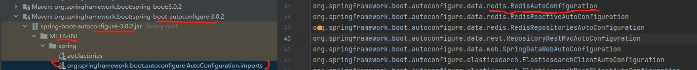

### FAQ

- [使用SpringBoot时关于静态资源的访问问题](https://www.jianshu.com/p/5f5b82e7ee23)

```shell
# 项目路径
server.servlet.context-path=/test-demo
# 静态资源配置
spring.mvc.static-path-pattern=/static/**

# 访问地址 http://server:port/test-demo/static/xxx.jpg
```

- [解决决SpringBoot图片上传需重启服务器才能显示的问题](https://blog.csdn.net/qq_49137582/article/details/123601007)

```java
// 前端页面实现头像图片上传并实时更新显示的功能，但是文件上传成功后不能实时显示，必须重启服务器后才能显示出来
// 这是服务器的自我保护机制，为了防止暴露绝对路径
@Configuration
public class ImageUploadConfig implements WebMvcConfigurer {
        @Override
        public void addResourceHandlers(ResourceHandlerRegistry registry) {
        registry.addResourceHandler("/static/images/upload/**").addResourceLocations("file:E:\\Allworkspaces\\idea-workspace\\SpringBoot\\store\\src\\main\\resources\\static\\images\\upload\\");
    }
}
```

- mybatis sql 日志打印
    - mybatis/mybatis-plus 日志打印配置：这两个需要通过配置 [mybatis日志输出](https://mybatis.org/mybatis-3/zh/logging.html)
      ,或者配置 [mybatis-plus](https://baomidou.com/pages/f84a74/#%E5%90%AF%E5%8A%A8-mybatis-%E6%9C%AC%E8%BA%AB%E7%9A%84-log-%E6%97%A5%E5%BF%97)
      日志输出，最终都是配置 mybatis
      来输出日志，详细的配置可以参考 [How Does Mybatis-Plus Print SQL Logs and Parameters To The Log File Under SpringBoot](https://medium.com/illumination/how-does-mybatis-plus-print-sql-logs-and-parameters-to-the-log-file-under-springboot-d9573c30f9e6)

```yaml
#springBoot mybatis-plus配置
logging.level.com.baomidou.mybatisplus=DEBUG
  #Project mapper directory
logging.level.com.dragonsoft.demojar.mapper=DEBUG
mybatis-plus.configuration.log-impl=org.apache.ibatis.logging.slf4j.Slf4jImpl
```

- [Show Hibernate/JPA SQL Statements from Spring Boot](https://www.baeldung.com/sql-logging-spring-boot)
    - Spring Data JDBC,Java为关系数据库定义了一套标准的访问接口：`JDBC（Java Database Connectivity）`
      ,JDBC接口是Java标准库自带的,可以直接编译,具体的JDBC驱动是由数据库厂商提供的，例如，MySQL的JDBC驱动由Oracle提供。因此，访问某个具体的数据库，我们只需要引入该厂商提供的JDBC驱动，就可以通过JDBC接口来访问，这样保证了Java程序编写的是一套数据库访问代码，却可以访问各种不同的数据库，因为他们都提供了标准的JDBC驱动.实际上，一个MySQL的JDBC的驱动就是一个jar包，它本身也是纯Java编写的。我们自己编写的代码只需要引用Java标准库提供的java.sql包下面的相关接口，由此再间接地通过MySQL驱动的jar包通过网络访问MySQL服务器，所有复杂的网络通讯都被封装到JDBC驱动中，因此，Java程序本身只需要引入一个MySQL驱动的jar包就可以正常访问MySQL服务器
    - Spring Data JPA, makes it easy to easily implement JPA-based `(Java Persistence API)` repositories. JPA就是JavaEE的一个
      ORM 标准，它的实现其实和 Hibernate 没啥本质区别，但是用户如果使用JPA，那么引用的就是`jakarta.persistence`这个“标准”包，而不是`org.hibernate`
      这样的第三方包。因为JPA只是接口，所以，还需要选择一个实现产品，跟JDBC接口和MySQL驱动一个道理。 我们使用JPA时也完全可以选择 `Hibernate`
      作为底层实现，但也可以选择其它的JPA提供方，比如 `EclipseLink`。Spring内置了JPA的集成，并支持选择 `Hibernate` 或 `EclipseLink` 作为实现

```yaml
  #To Standard Output
  spring.jpa.show-sql=true
  spring.jpa.properties.hibernate.format_sql=true
  #Via Loggers
  logging.level.org.hibernate.SQL=DEBUG
  logging.level.org.hibernate.type.descriptor.sql.BasicBinder=TRACE
  #Logging JdbcTemplate Queries
  logging.level.org.springframework.jdbc.core.JdbcTemplate=DEBUG
  logging.level.org.springframework.jdbc.core.StatementCreatorUtils=TRACE
```

- [mybatis mapper xml 字段和表自动提示](https://blog.csdn.net/b452608/article/details/122704798)
- [spring boot 配置项查看](https://docs.spring.io/spring-boot/docs/current/reference/htmlsingle/#features.developing-auto-configuration.understanding-auto-configured-beans)
  
- [spring-boot 文档以及配置项](https://docs.spring.io/spring-boot/docs/2.0.1.RELEASE/reference/htmlsingle/#common-application-properties)
- [mvn cli options](https://maven.apache.org/ref/3.6.1/maven-embedder/cli.html)
- [spring-boot-maven-plugin 默认继承参数](https://docs.spring.io/spring-boot/maven-plugin/using.html)

- [spring-boot 项目 lib 包和项目 class 文件分开打包](https://www.cnblogs.com/qdhxhz/p/17477778.html)

```xml
<!--需要先正常打包，将lib文件夹拷贝出来，然后在使用 ZIP layout 打包，启动的时候需要指定lib包路径  java -Dloader.path=./lib -jar app.jar-->

<build>
    <plugins>
        <plugin>
            <groupId>org.springframework.boot</groupId>
            <artifactId>spring-boot-maven-plugin</artifactId>
            <configuration>
                <executable>true</executable>
                <layout>ZIP</layout>
                <!--这里是填写需要包含进去的jar，必须项目中的某些模块，会经常变动，那么就应该将其坐标写进来,如果没有则 nothing(不一定非要填写nothing，因为项目中没有一个叫nothing的依赖，所以打出来的包中就不包含任何依赖) ，表示不打包依赖 -->
                <includes>
                    <include>
                        <groupId>nothing</groupId>
                        <artifactId>nothing</artifactId>
                    </include>
                </includes>
            </configuration>
        </plugin>
    </plugins>
</build>
```

### springBoot 重要的类

- `ApplicationContext`
- `BeanFactory` `BeanNameAware`
- `ApplicationContextAware`：通过实现此接口，Bean 可以直接访问 ApplicationContext，从而能够动态获取其他 Bean、资源文件、环境配置等容器级功能
- `ApplicationRunner` or `CommandLineRunner`
- `JsonObjectSerializer` and `JsonObjectDeserializer`
- `BeanPostProcessor`接口: 用于在 Spring 容器实例化、配置以及初始化 bean 的过程中对 bean 进行自定义处理。它允许开发者在 bean 的生命周期的特定阶段插入自定义逻辑，**
  BeanPostProcessor** 会作用于容器中的所有 **bean**,：多个 **BeanPostProcessor** 可以通过实现 **Ordered** 接口或使用 **@Order** 注解来指定执行顺序。
- `RequestContextHolder`:是 Spring 框架提供的一个工具类，用于在当前线程中存储和访问 HTTP 请求的上下文信息。它通过 ThreadLocal 机制来实现这一点，使得在应用的任何地方都能获取到当前请求的信息，而不需要直接传递这些信息作为方法参数。

- `FilterRegistrationBean`: 是 Spring Framework 提供的一个类，主要用于在 Servlet 容器中注册自定义的 Filter。它允许开发者以编程方式配置过滤器，而不是通过传统的 web.xml 配置文件来完成。
- `OncePerRequestFilter`
- `@Autowired` applies to fields, constructors, and multi-argument methods, allowing for narrowing through `@Qualifier`
  annotations at the parameter level. In contrast, `@Resource` is supported only for fields and bean property setter
  methods with a single argument.`@Resource` takes a name attribute. By default, Spring interprets that value as the
  bean name to be injected


- `@Value` is typically used to inject externalized properties
- `@PostConstruct` and `@PreDestroy`: lifecycle annotations
- stereotype annotations: `@Component, @Service, @Repository,and @Controller`. Spring can automatically detect
  stereotyped
  classes and register corresponding BeanDefinition instances with the `ApplicationContext`.To autodetect these classes
  and register the corresponding beans, you need to add `@ComponentScan` to your `@Configuration` class.By default,
  classes annotated with @Component, @Repository, @Service, @Controller, @Configuration, or a custom annotation that
  itself is annotated with @Component are the only detected candidate components.
- @Configuration 来注解一个类，表明它的主要目的是作为Bean定义的来源。此外， @Configuration 类允许通过调用同一个类中的其他 @Bean 方法来定义bean间的依赖关系。

- @RequestParam:
  URL参数：适用于GET请求，参数拼接在URL中,`http://example.com/api?param1=value1&param2=value2`;表单参数：适用于POST请求，Content-Type为`application/x-www-form-urlencoded`，参数在请求体中以键值对形式传递。
- @RequestBody: 适用于POST、PUT等请求，Content-Type为`application/json`
- @ModelAttribute 表单参数：与`@RequestParam`类似，适用于Content-Type为`application/x-www-form-urlencoded`的POST请求。
  JSON数据：与`@RequestBody`类似，适用于Content-Type为`application/json`的POST请求。
- @RequestPart 文件上传：适用于`multipart/form-data`类型的请求，用于上传文件和其他表单数据
- @PathVariable: 用于从URL路径中获取参数
- @RequestHeader: 用途：用于获取请求头中的参数。
- @CookieValue: 用途：用于获取请求中的Cookie值
- @SessionAttribute: 用途：用于从HTTP Session中获取属性
- 不同类型请求中混合使用@RequestParam、@RequestBody、@ModelAttribute和@RequestPart注解时，需要根据请求的Content-Type和具体需求进行搭配

- @DependsOn: forces certain other beans to be initialized first
- @Profile: this annotation lets you indicate that a component is eligible for registration when one or more specified
  profiles are active.
- ApplicationListener && ApplicationEvent && @EventListener :If a bean that implements the ApplicationListener interface
  is deployed into the context, every time an ApplicationEvent gets published to the ApplicationContext, that bean is
  notified.
- Converter :

### AOP

AOP（面向切面编程）是一种编程范式，用于将横切关注点（如日志、事务管理、安全检查等）与业务逻辑分离。AOP 的实现主要依赖于 AOP 框架，其中最流行的两个框架是 **Spring AOP** 和 **AspectJ**。
Spring AOP 基于动态代理（JDK 动态代理或 CGLIB），运行时织入,主要支持方法级别的拦截，不支持字段级或构造器级别的通知.AspectJ
基于字节码修改，支持编译时、类加载时和运行时织入,支持更广泛的连接点类型，包括方法调用、字段访问、构造器调用等

AOP 核心概念

- 切面（Aspect）：封装横切关注点的模块，包含切入点和通知。
- 切入点（Pointcut）：通过表达式定义通知触发的位置。
- 通知（Advice）：在特定的连接点执行的动作，如方法执行前后执行的代码

## jdbc

JDBC（Java Database Connectivity，Java数据库连接）是一种用于执行SQL语句的Java
API，它为多种关系数据库提供统一访问。JDBC由一组用Java语言编写的类和接口组成，使得数据库开发人员能够编写数据库应用程序。

主要功能

• **与数据库建立连接**：JDBC允许Java应用程序连接到各种关系型数据库，如MySQL、Oracle、PostgreSQL等。
• **发送操作数据库的语句**：通过JDBC，可以执行各种SQL语句，包括查询、插入、更新和删除操作。
• **处理结果**：JDBC提供了处理查询结果的方法，使得开发人员可以方便地获取和操作数据库中的数据。

编程步骤

1. **注册驱动**：加载并注册要使用的数据库驱动程序。
2. **建立连接**：通过`DriverManager.getConnection()`方法建立与数据库的连接。
3. **创建Statement对象**：使用`Connection.createStatement()`方法创建一个`Statement`对象，用于执行SQL语句。
4. **执行SQL语句**：使用`Statement.executeQuery()`或`Statement.executeUpdate()`方法执行SQL查询或更新操作。
5. **处理结果集**：如果执行的是查询操作，使用`ResultSet`对象遍历查询结果。
6. **关闭资源**：操作完成后，关闭`ResultSet`、`Statement`和`Connection`对象，释放资源。

DBC的应用场景

• **数据库查询和更新**：使用JDBC可以方便地进行数据库查询和更新操作。
• **数据库连接池**：在高并发的应用程序中，使用JDBC连接池可以提高性能并减少对数据库的连接请求。
• **ORM框架**：许多Java ORM框架（如Hibernate和MyBatis）底层都使用JDBC来访问数据库。
• **数据库工具**：许多数据库管理工具也使用JDBC与数据库进行通信和操作。

Hibernate 是一个开放源代码的对象关系映射（ORM）框架，它对 JDBC 进行了轻量级的对象封装,使用HQL（Hibernate Query Language），这是一种面向对象的查询语言

JTA（Java Transaction API） 定义：JTA是Java平台的一部分，用于支持分布式事务管理，允许应用程序在多个网络计算机资源上执行事务

JPA（Java Persistence API） 定义：JPA是Java EE平台的一部分，用于对象关系映射（ORM），将Java对象持久化到关系型数据库中

## 事务

本地事务和全局事务是数据库事务管理的两种主要类型

本地事务
定义：本地事务是指在单个数据库或资源管理器中执行的事务，事务的生命周期完全由该资源管理器控制。典型的本地事务使用数据库提供的ACID特性来保证事务的原子性、一致性、隔离性和持久性，严格支持ACID特性，确保事务的可靠性和数据的一致性，只能管理单个数据库或资源，无法处理跨多个数据库或服务的事务

全局事务 定义：全局事务是指跨越多个数据库、服务或资源管理器的事务，事务的生命周期由一个全局事务管理器（Transaction Manager）协调和管理。全局事务通常遵循X/Open DTP（Distributed Transaction
Processing）模型，使用两阶段提交（2PC）协议来保证事务的原子性

spring事务

- 编程式事务管理: 你可以直接使用 PlatformTransactionManager 来管理事务,编程式事务管理允许开发者通过编写代码来控制事务的边界。这意味着你可以明确地指定何时开始一个事务、何时提交或者回滚事务。
- 声明式事务管理 ：更常用的是声明式事务管理，通过使用注解（如 `@Transactional`
  ）或者XML配置来定义事务边界。声明式事务的最小作用单位是方法级，这意味着如果你想为某段代码块应用事务，你需要将其封装到一个单独的方法中。声明式事务管理基于AOP（面向切面编程），这会在方法调用时引入额外的代理层，可能会带来一定的性能开销。声明式事务管理只能应用于Spring容器中托管的Bean方法上。这意味着如果你的应用中有未被Spring管理的对象，你将无法直接使用Spring的声明式事务管理

Spring定义了七种事务传播行为，这些行为决定了当一个业务方法被另一个业务方法调用时，应该如何进行事务控制。以下是这七种传播行为的简要说明：

- **REQUIRED**：这是默认的行为。如果当前存在事务，则加入该事务；如果不存在，则创建一个新的事务。大多数需要事务控制的业务逻辑都适用此模式，如转账操作
- **SUPPORTS**：如果当前存在事务，则加入该事务；如果不存在，则以非事务方式执行。适用于查询操作或不需要严格事务控制的操作
- **MANDATORY**：如果当前存在事务，则加入到当前事务中；如果当前没有事务，则抛出异常。确保某些方法必须在事务环境中执行，例如资金结算等关键操作
- **REQUIRES_NEW**：总是创建一个新的事务，如果当前存在事务，则挂起当前事务。当某个操作需要独立于其他事务时，如日志记录、审计跟踪等
- **NOT_SUPPORTED**：以非事务方式执行操作，如果当前存在事务，则挂起当前事务。适用于那些不应该在事务内执行的操作，比如一些性能密集型的读取操作
- **NEVER**：以非事务方式执行操作，如果当前存在事务，则抛出异常。用于明确禁止在事务上下文中执行的方法
- **NESTED**：如果当前已经存在一个事务，则在嵌套事务内执行；如果当前没有事务，则其行为与 `REQUIRED` 一样。适合需要**回滚部分事务**而保持其余部分不变的情况，比如多步骤的复杂业务流程

以下示例，查询操作：当用户请求查看某个订单的详细信息时，会调用 `getOrderDetails()` 方法。由于这是一个只读操作，不强制要求在事务中执行，因此可以使用 `SUPPORTS`
传播行为。这样，如果该方法被其他事务性方法调用（例如在一个已经开启的事务中），它可以参与到这个事务中；如果没有事务存在，它将以非事务的方式运行，这有助于减少系统开销。

```java
import org.springframework.transaction.annotation.Propagation;
import org.springframework.transaction.annotation.Transactional;

public class OrderService {

    // 使用 SUPPORTS 传播行为，如果当前存在事务，则加入该事务；如果没有事务，则以非事务方式执行。
    @Transactional(propagation = Propagation.SUPPORTS)
    public Order getOrderDetails(Long orderId) {
        // 查询订单详情的逻辑
        return orderRepository.findById(orderId);
    }

    // 默认使用 REQUIRED 传播行为，即如果有事务则加入，没有则创建新事务
    @Transactional
    public void updateOrderStatus(Long orderId, String newStatus) {
        Order order = orderRepository.findById(orderId);
        order.setStatus(newStatus);
        orderRepository.save(order);
    }
}
```

- 如果一个方法不加@transactional注解，它被一个添加了@transactional注解的方法调用，会发生什么
  当一个未添加 `@Transactional` 注解的方法被一个存在事务的方法调用时，其行为取决于调用方式和事务传播机制。以下是具体分析：

Spring 的事务管理基于 **AOP 代理** 实现，因此调用路径决定了事务是否生效：

**情况 1：跨类调用（通过代理对象调用）**

- **场景**：方法 A（有 `@Transactional`）在另一个类的方法 B（无 `@Transactional`）上调用。
- **结果**：
    - 方法 B **会参与方法 A 的事务**。
    - 方法 B 的操作会加入方法 A 的事务中，事务的提交或回滚由方法 A 决定。
    - 如果方法 A 的事务回滚（如抛出未捕获的异常），方法 B 的操作也会被回滚。

  **示例代码**：
  ```java
  @Service
  public class ServiceA {
      @Autowired
      private ServiceB serviceB;

      @Transactional
      public void methodA() {
          serviceB.methodB(); // 跨类调用，通过代理对象
      }
  }

  @Service
  public class ServiceB {
      public void methodB() { // 无 @Transactional
          // 操作数据库，参与 ServiceA 的事务
      }
  }
  ```

**情况 2：同一类内部调用（直接调用）**

- **场景**：方法 A（有 `@Transactional`）在同一个类中调用方法 B（无 `@Transactional`）。
- **结果**：
    - 方法 B **不会参与事务**。
    - 因为内部调用会绕过代理对象，直接调用目标对象的方法，Spring 无法拦截并应用事务。
    - 方法 B 的操作会以独立的非事务方式执行（自动提交模式）。

**示例代码**：

```java
@Service
public class ServiceA {
  @Transactional
  public void methodA() {
      methodB(); // 直接调用同一类的方法，不经过代理
  }

  public void methodB() { // 无 @Transactional
      // 操作数据库，不参与事务
  }
}
```

通过以上分析，可以明确：**未加 `@Transactional` 的方法是否参与事务，完全取决于调用路径是否经过代理**。

### 隔离级别

Spring提供的事务隔离级别与标准SQL的隔离级别保持一致，共有五种主要的隔离级别：

- `ISOLATION_DEFAULT`：使用数据库的默认隔离级别。它会依赖数据库的默认设置（例如，MySQL 默认是 `REPEATABLE_READ`，Oracle 默认是 `READ_COMMITTED`）
- `ISOLATION_READ_UNCOMMITTED`：允许读取尚未提交的数据，可能导致脏读、不可重复读和幻读。这是最低的隔离级别,非常罕见使用，通常用于对性能要求极高但对数据一致性要求极低的场景,可能导致以下问题：
    - 脏读: 读取到未提交的数据。
    - 不可重复读: 同一事务多次读取同一数据可能得到不同的结果。
    - 幻读: 查询范围内的数据行数可能发生改变。**幻读（Phantom Read）**
      是数据库事务并发控制中的一个现象，它发生在当两个事务同时运行时，其中一个事务能够看到另一个事务插入或删除的数据行，这些数据行在该事务开始时并不存在或者存在但后来被删除了。换句话说，在同一个事务内执行相同的查询可能会得到不同的结果集，这种现象就称为“幻读”。
- `ISOLATION_READ_COMMITTED(读已提交)`：避免脏读，但可能出现不可重复读和幻读。大多数应用场景中使用的隔离级别，适合需要避免脏读但可以容忍不可重复读或幻读的场景
- `ISOLATION_REPEATABLE_READ`：确保同一事务内多次读取数据的一致性，避免脏读和不可重复读，但可能出现幻读。需要确保事务内的多次读取结果一致，但可以容忍幻读的场景。例如，银行系统中的余额查询
- `ISOLATION_SERIALIZABLE`
  ：提供最高级别的隔离，防止所有并发问题，包括幻读，但是性能最差。对数据一致性要求极高的场景，例如金融系统中的转账操作。注意，由于其严格的锁定机制，可能导致性能问题。在事务执行期间，其他事务无法插入新数据或修改相关数据，从而完全避免幻读


在Spring框架中，当应用程序需要管理多个事务管理器（Transaction Managers）时，可以使用 `@Transactional` 注解的 `transactionManager` 属性来指定要使用的事务管理器。这种情况通常出现在以下场景：

- 多数据源：应用程序连接到多个数据库，每个数据库需要独立的事务管理。
- 混合事务类型：例如，一个事务管理器用于JDBC操作，另一个用于JMS消息队列。


### spring jdbc
在Spring框架中，`JdbcTemplate` 和 `NamedParameterJdbcTemplate` 是用于简化数据库操作的核心工具。它们封装了JDBC的底层细节（如连接管理、异常处理等），使得开发者可以专注于SQL逻辑和数据操作。

JdbcTemplate
```java
import org.springframework.jdbc.core.JdbcTemplate;
import org.springframework.beans.factory.annotation.Autowired;
import org.springframework.stereotype.Repository;

@Repository
public class UserRepository {

    @Autowired
    private JdbcTemplate jdbcTemplate;

    public void insertUser(String name, int age) {
        String sql = "INSERT INTO users (name, age) VALUES (?, ?)";
        jdbcTemplate.update(sql, name, age);
    }
}
```
NamedParameterJdbcTemplate
```java
import org.springframework.jdbc.core.namedparam.MapSqlParameterSource;

public User getUserByNameAndAge(String name, int age) {
    String sql = "SELECT * FROM users WHERE name = :name AND age = :age";
    MapSqlParameterSource params = new MapSqlParameterSource();
    params.addValue("name", name);
    params.addValue("age", age);

    return namedParameterJdbcTemplate.queryForObject(sql, params, (rs, rowNum) -> {
        User user = new User();
        user.setId(rs.getInt("id"));
        user.setName(rs.getString("name"));
        user.setAge(rs.getInt("age"));
        return user;
    });
}
```


`JdbcTemplate`：适合简单的SQL操作，使用位置参数（?）。
`NamedParameterJdbcTemplate`：基于JdbcTemplate实现,适合复杂的SQL操作，使用命名参数（:paramName），更具可读性和灵活性。
在实际开发中，可以根据具体需求选择合适的工具。如果需要处理复杂的SQL语句，推荐优先使用NamedParameterJdbcTemplate。
