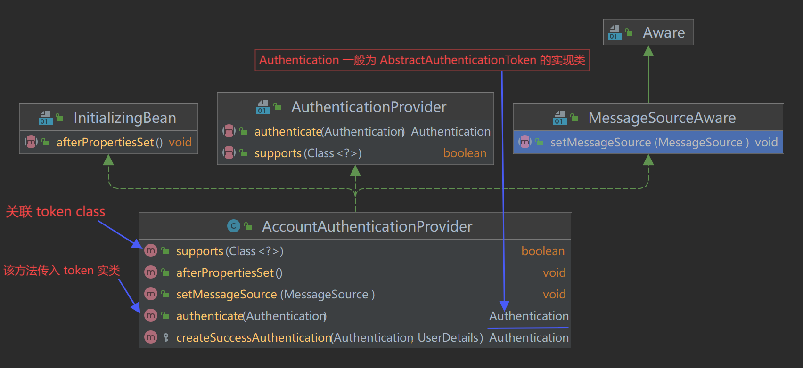
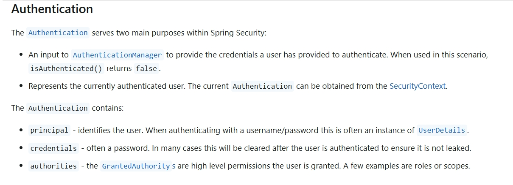
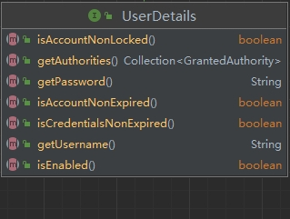
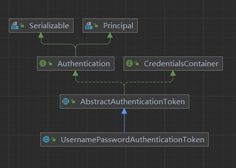

Spring Security’s Servlet support is based on Servlet Filters.Spring provides a Filter implementation named `DelegatingFilterProxy` that allows bridging between the Servlet container’s lifecycle and Spring’s ApplicationContext.

## 认证流程
Spring Security 的认证流程涉及多个组件和步骤，它基于过滤器链（`SecurityFilterChain`）来实现。以下是 Spring Security 认证过程的概览：

1. **请求拦截**：
    - 当用户尝试访问受保护的资源时，Spring Security 的过滤器链会首先拦截这个请求。

2. **生成未认证的 Authentication 对象**：
    - 如果请求需要认证，一个未认证的 `Authentication` 对象会被创建，并且通常包含用户名和密码等信息。

3. **调用 AuthenticationManager 进行认证**：
    - 该 `Authentication` 对象被传递给 `AuthenticationManager` 来进行认证。
    - `ProviderManager` 是 `AuthenticationManager` 的默认实现，它内部维护了一个 `AuthenticationProvider` 列表，每个 `AuthenticationProvider` 都可以处理特定类型的认证逻辑。

4. **认证处理**：
    - `AuthenticationProvider` 实现了具体的认证逻辑。例如，`DaoAuthenticationProvider` 用于验证数据库中的用户信息。
    - 如果认证成功，`AuthenticationProvider` 返回一个完全填充的 `Authentication` 对象，其中包含用户的权限信息；如果认证失败，则抛出异常。

5. **认证结果处理**：
    - 如果认证成功，`Authentication` 对象将被存储在 `SecurityContextHolder` 中，使得当前线程能够访问到当前已认证的用户信息。
    - 如果认证失败，可能会重定向到登录页面或返回错误消息提示用户重新登录。

6. **安全上下文管理**：
    - `SecurityContextHolder` 使用 `ThreadLocal` 存储 `SecurityContext`，确保每个请求都能获取到当前用户的认证信息。
    - `SecurityContext` 包含了 `Authentication` 对象。

7. **权限验证**：
    - 在 `FilterSecurityInterceptor` 中，从 `SecurityContextHolder` 获取 `Authentication` 对象，并检查用户是否拥有访问所需资源的权限。

8. **资源访问**：
    - 如果用户通过了认证并具有适当的权限，则允许访问所请求的资源；否则，访问将被拒绝，并可能引发 `AccessDeniedException` 或者要求用户再次登录。

此外，Spring Security 支持多种认证方式，如表单登录、HTTP Basic、OAuth2 和 JWT 等。你可以根据需求选择合适的认证方式，并通过自定义过滤器和处理器来扩展认证流程。例如，在使用 JWT 时，你可能需要编写一个自定义的过滤器来解析 JWT 并设置 `SecurityContextHolder`。这通常涉及到实现 `OncePerRequestFilter` 类并覆盖 `doFilterInternal` 方法。

## 第三方登录流程概述
第三方登录通常基于OAuth 2.0或OpenID Connect（OIDC）协议来实现。以下是使用Spring Security集成第三方登录（以Google为例）的典型流程：

1. **用户发起请求**：
   - 用户点击应用界面上的“使用XXX登录”按钮，比如“使用Google登录”。

2. **重定向到身份提供商**：
   - 应用将用户重定向到Google的身份验证页面，同时传递一些必要的参数，如客户端ID、回调URL（redirect URI）、作用域（scope）等。

3. **用户授权**：
   - 在Google的身份验证页面上，用户输入其凭据并同意授予应用访问其某些信息的权限。

4. **获取授权码**：
   - 如果用户成功授权，Google会重定向用户回到应用提供的回调URL，并在URL中附带一个授权码（authorization code）。

5. **交换授权码为访问令牌**：
   - 应用接收到这个授权码后，会向Google发送一个HTTP请求，包含授权码、客户端ID、客户端密钥以及回调URL，来换取访问令牌（access token）。

6. **获取用户信息**：
   - 应用使用得到的访问令牌向Google的用户信息端点发起请求，获取用户的个人信息，如用户名、电子邮件地址等。

7. **创建或更新本地用户账户**：
   - 根据从Google获得的用户信息，在本地数据库中查找是否存在对应的用户记录。如果不存在，则可能需要提示用户绑定现有账户或自动创建新账户。

8. **建立用户会话**：
   - 成功获取用户信息之后，应用会在本地建立一个用户会话，使用户保持登录状态，然后重定向用户到应用内的目标页面。

9. Spring Security 集成步骤

   - **添加依赖**：在`pom.xml`或`build.gradle`文件中添加`spring-boot-starter-oauth2-client`依赖。
   - **配置第三方登录提供商**：在`application.yml`或`application.properties`文件中设置OAuth2客户端的注册信息和提供商的具体配置。
   - **安全过滤器链配置**：通过继承`WebSecurityConfigurerAdapter`类并覆盖`configure(HttpSecurity http)`方法，定义哪些路径需要认证，启用OAuth2登录支持。
   - **自定义OAuth2用户服务**（可选）：根据需求自定义处理获取到的用户信息的逻辑。

### Reference
- [architecture](https://docs.spring.io/spring-security/reference/servlet/architecture.html)

AccountAuthenticationProvider

Authentication

UserDetails

CustomToken

