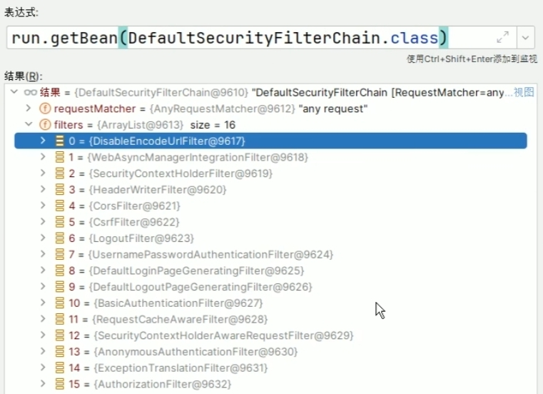
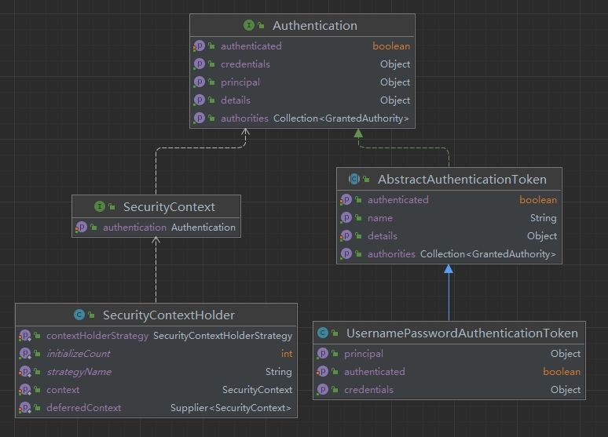
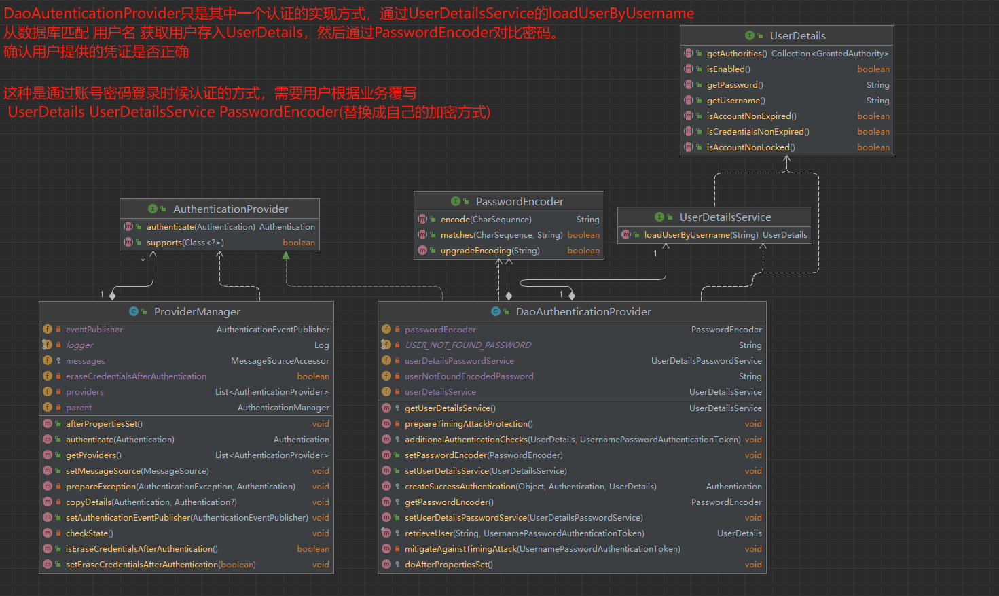
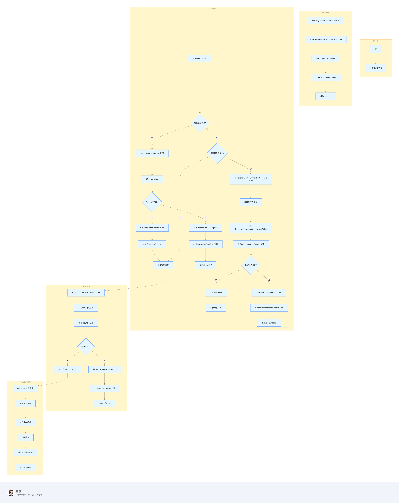

Spring Security 的核心是一个**过滤器链（FilterChain）**，每个请求都会经过一系列过滤器处理，最终实现认证和授权。主要分为两大流程：

1. **认证流程**：验证用户身份（如用户名密码、令牌等）。
2. **授权流程**：检查用户是否有权限访问特定资源。

**关键类与接口**：

1. **过滤器（Filter）**：
    - `UsernamePasswordAuthenticationFilter`：处理表单登录请求。
    - `BasicAuthenticationFilter`：处理HTTP Basic认证。
    - `OAuth2LoginAuthenticationFilter`：处理OAuth2登录。

2. **认证管理器（AuthenticationManager）**：
    - `ProviderManager`：默认实现，委托给多个`AuthenticationProvider`。

3. **认证提供者（AuthenticationProvider）**：
    - `DaoAuthenticationProvider`：基于数据库的认证，使用`UserDetailsService`加载用户信息。

4. **用户信息（UserDetails）**：
    - `UserDetailsService`：加载用户信息的接口（如从数据库查询）。
    - `UserDetails`：用户信息的封装（包含用户名、密码、权限等）。

5. **安全上下文（SecurityContext）**：
    - `SecurityContextHolder`：存储当前认证用户的上下文。
    - `Authentication`：认证信息的接口，包含用户主体、凭证、权限等。

## SpringSecurity 过滤器链

springSecurity 过滤器链可以通过查看 `DefaultSecurityFilterChain` 这个类中的 `List<Filter> filters` 属性得到，默认如下图所示

## SpringSecurity Authentication

springSecurity Authentication

下面是账号密码认证关键类，结合上图 `UserNamePasswordAuthenticationToken` ，即可完成认证

下图是一个常见的 `jwt + username + password` 认证流程

如果需要**自定义其它认证方式**，则需要 实现 `AuthenticationProvider` 接口，自定义 `authenticate` 方法，并将自定义的 provider 注册到 `ProviderManager` 上， 还需要
继承 `AbstractAuthenticationToken`

[//]: # (<AuthenticationProvider />)
