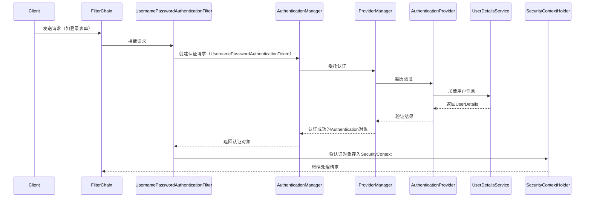
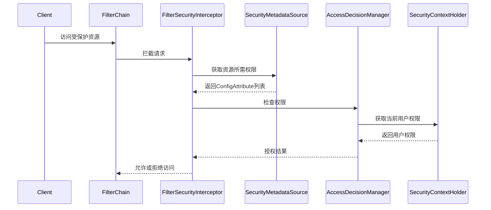

### Spring Security 认证授权流程详解

#### **一、整体架构**
Spring Security 的核心是一个**过滤器链（FilterChain）**，每个请求都会经过一系列过滤器处理，最终实现认证和授权。主要分为两大流程：
1. **认证流程**：验证用户身份（如用户名密码、令牌等）。
2. **授权流程**：检查用户是否有权限访问特定资源。

#### **二、认证流程（Authentication）**

**关键类与接口**：
1. **过滤器（Filter）**：
    - `UsernamePasswordAuthenticationFilter`：处理表单登录请求。
    - `BasicAuthenticationFilter`：处理HTTP Basic认证。
    - `OAuth2LoginAuthenticationFilter`：处理OAuth2登录。

2. **认证管理器（AuthenticationManager）**：
    - `ProviderManager`：默认实现，委托给多个`AuthenticationProvider`。

3. **认证提供者（AuthenticationProvider）**：
    - `DaoAuthenticationProvider`：基于数据库的认证，使用`UserDetailsService`加载用户信息。

4. **用户信息（UserDetails）**：
    - `UserDetailsService`：加载用户信息的接口（如从数据库查询）。
    - `UserDetails`：用户信息的封装（包含用户名、密码、权限等）。

5. **安全上下文（SecurityContext）**：
    - `SecurityContextHolder`：存储当前认证用户的上下文。
    - `Authentication`：认证信息的接口，包含用户主体、凭证、权限等。

#### **三、授权流程（Authorization）**

**关键类与接口**：
1. **过滤器（Filter）**：
    - `FilterSecurityInterceptor`：负责授权检查的最后一道过滤器。

2. **安全元数据（SecurityMetadata）**：
    - `SecurityMetadataSource`：定义资源所需的权限（如URL与角色的映射）。

3. **访问决策管理器（AccessDecisionManager）**：
    - `AffirmativeBased`：默认实现，只要有一个权限通过则允许访问。
    - `ConsensusBased`：多数同意才允许访问。
    - `UnanimousBased`：全体同意才允许访问。

4. **投票器（Voter）**：
    - `RoleVoter`：基于角色的投票器。
    - `AuthenticatedVoter`：基于认证状态的投票器。

#### **四、用户自定义点**
1. **认证自定义**：
    - 实现`UserDetailsService`：自定义用户信息加载逻辑（如从数据库、LDAP等）。
    - 实现`AuthenticationProvider`：自定义认证方式（如短信验证码、指纹识别）。
    - 自定义过滤器：添加自定义认证过滤器（如JWT认证过滤器）。

2. **授权自定义**：
    - 实现`SecurityMetadataSource`：自定义资源权限映射（如基于数据库的动态权限）。
    - 实现`AccessDecisionManager`：自定义访问决策逻辑。
    - 实现`Voter`：自定义投票器（如基于数据权限的投票器）。

3. **安全配置**：
    - 配置`WebSecurityConfigurerAdapter`：自定义安全策略（如哪些URL需要认证、哪些公开）。
    - 配置密码编码器（PasswordEncoder）：自定义密码加密方式（如BCrypt）。

4. **异常处理**：
    - 实现`AuthenticationEntryPoint`：自定义未认证时的响应（如返回JSON而非重定向）。
    - 实现`AccessDeniedHandler`：自定义权限不足时的响应。

5. **会话管理**：
    - 配置`SessionAuthenticationStrategy`：自定义会话并发控制。
    - 实现`RememberMeServices`：自定义"记住我"功能。

#### **五、Spring Security 5+ 新特性**
1. **响应式安全（WebFlux）**：
    - 使用`ReactiveSecurityContextHolder`和`ReactiveAuthenticationManager`。

2. **OAuth2 支持增强**：
    - 内置`OAuth2LoginAuthenticationFilter`处理第三方登录。
    - 支持JWT令牌验证（`JwtDecoder`）。

3. **密码编码更新**：
    - 推荐使用`DelegatingPasswordEncoder`支持多种编码方式。
