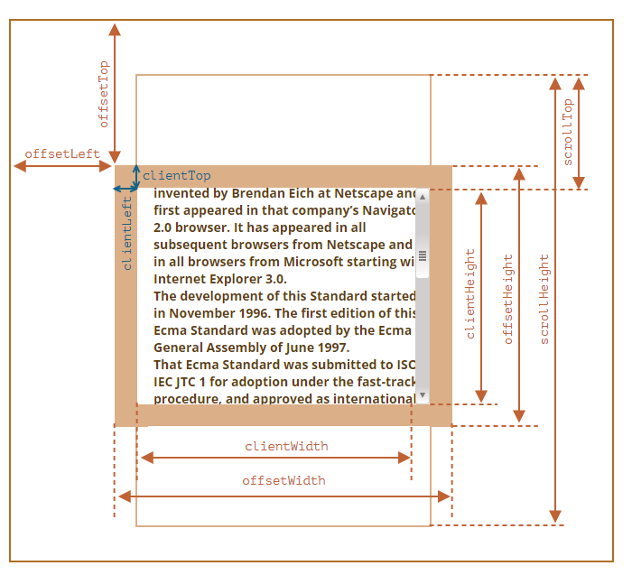
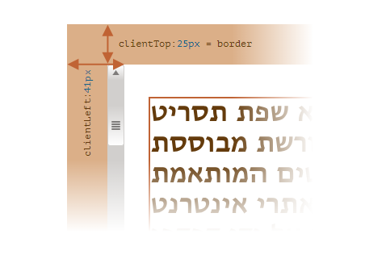
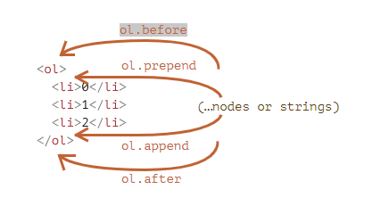
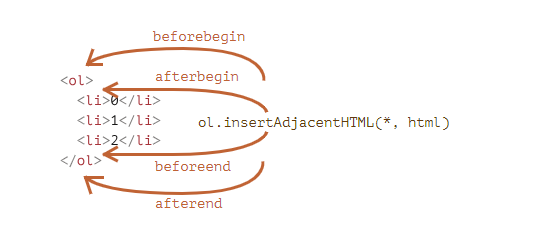

## window

- [window.scrollY](https://developer.mozilla.org/en-US/docs/Web/API/Window/scrollY): the number of pixels that the
  document is currently scrolled vertically.
- [window.scrollX](https://developer.mozilla.org/en-US/docs/Web/API/Window/scrollX): the number of pixels that the
  document is currently scrolled horizontally
- [window.pageYOffset](https://developer.mozilla.org/en-US/docs/Web/API/Window/pageYOffset): an alias for window.scrollY
- [window.pageXOffset ](https://developer.mozilla.org/en-US/docs/Web/API/Window/pageXOffset): an alias for
  window.scrollX

```js
// 获取元素相对于文档的坐标
function getCoords(elem) {
    let box = elem.getBoundingClientRect();

    return {
        top: box.top + window.pageYOffset,
        left: box.left + window.pageXOffset
    };
}
```

## 窗口 vs 文档

### 窗口的 **width/height**

- `documentElement.clientHeight/documentElement.clientWidth`: 没有滚动条（减去它）的 width/height
- `window.innerWidth/innerHeight`: 包括了滚动条

### 文档的 **width/height**

理论上讲，由于根文档元素是 document.documentElement，并且它包围了所有内容，因此我们可以通过使用 `documentElement.scrollWidth/scrollHeight`
来测量文档的完整大小。但是会有浏览器兼容性问题

为了可靠地获得完整的文档高度，我们应该采用以下这些属性的最大值

```js
let scrollHeight = Math.max(
    document.body.scrollHeight, document.documentElement.scrollHeight,
    document.body.offsetHeight, document.documentElement.offsetHeight,
    document.body.clientHeight, document.documentElement.clientHeight
);

```

DOM 元素的当前滚动状态在其 **scrollLeft/scrollTop** 属性中, 但在较旧的基于 **WebKit** 的浏览器中则不行,幸运的是,我们可以从 **window.pageXOffset/pageYOffset**
中获取页面当前滚动信息， 也可以从 window 的 **scrollX** 和 **scrollY** 属性中获取滚动信息

### 滚动的实现方式：

- 可以通过更改 scrollTop/scrollLeft 来滚动常规元素
- `window.scrollBy(x,y)`: 将页面滚动至 相对于当前位置的 (x, y)
- `window.scrollTo(pageX,pageY)`: 将页面滚动至 绝对坐标 (pageX, pageY)
- `elem.scrollIntoView(top=true)`: 滚动页面以使 elem 可见

禁止滚动：只需要设置 `document.body.style.overflow = "hidden"`, 使用 `document.body.style.overflow = ''` 恢复滚动, 这个方法的缺点是会使滚动条消失,
页面布局会变动，我们可以在 **document.body** 中滚动条原来的位置处通过添加 **padding**，来替代滚动条， 这样这个问题就解决了

### 元素尺寸



- `offsetParent` 是最接近的祖先（ancestor），在浏览器渲染期间，它被用于计算坐标,最近的祖先为下列之一：
    - CSS 定位的（position 为 absolute、relative、fixed 或 sticky），
    - 或 `<td>，<th>，<table>`，
    - 或` <body>`
- 有以下几种情况下,offsetParent 的值为 null：
    - 对于未显示的元素（display:none 或者不在文档中）。
    - 对于 `<body>` 与 `<html>`。
    - 对于带有 position:fixed 的元素
- `offsetLeft/offsetTop`: 提供相对于 offsetParent 左上角的 x/y 坐标

- `offsetWidth/Height`: 元素的“外部” width/height。或者，换句话说，它的完整大小（包括边框）
- 如果一个元素（或其任何祖先）具有 **display:none** 或不在文档中，则所有几何属性均为零（或 offsetParent 为 null），例如，当我们创建了一个元素，但尚未将其插入文档中，或者它（或它的祖先）具有
  display:none 时，offsetParent 为 null，并且 offsetWidth 和 offsetHeight 为 0

```js
// 可以用它来检查一个元素是否被隐藏
// 对于会展示在屏幕上，但大小为零的元素，它们的 isHidden 返回 true
function isHidden(elem) {
    return !elem.offsetWidth && !elem.offsetHeight;
}

```

- clientTop/Left: 边框宽度,但准确地说 —— 这些属性不是边框的 width/height，而是内侧与外侧的相对坐标，当文档从右到左显示（操作系统为阿拉伯语或希伯来语）时，此时滚动条不在右边，而是在左边，此时
  clientLeft 则包含了滚动条的宽度。

  
- clientWidth/Height：包括了 “content width” 和 “padding”，但不包括滚动条宽度（scrollbar）

- scrollWidth/Height: 这些属性就像 clientWidth/clientHeight，但它们还包括滚动出（隐藏）的部分
- scrollLeft/scrollTop: 属性 scrollLeft/scrollTop 是元素的隐藏、滚动部分的 width/height

### css width vs clientWidth

- clientWidth 值是数值，而 getComputedStyle(elem).width 返回一个以 px 作为后缀的字符串。
- getComputedStyle 可能会返回非数值的 width，例如内联（inline）元素的 "auto"。
- clientWidth 是元素的内部内容区域加上 padding，而 CSS width（具有标准的 box-sizing）是内部内容区域，不包括 padding。
- 如果有滚动条，并且浏览器为其保留了空间，那么某些浏览器会从 CSS width 中减去该空间（因为它不再可用于内容），而有些则不会这样做。clientWidth 属性总是相同的：如果为滚动条保留了空间，那么将减去滚动条的大小。

### 计算滚动条宽度

```js
function computeScrollBarWidth() {
    // 创建一个包含滚动条的 div
    const div = document.createElement('div');
    div.style.overflowY = 'scroll';
    div.style.width = '50px';
    div.style.height = '50px';
// 必须将其放入文档（document）中，否则其大小将为 0
    document.body.append(div);
    let scrollWidth = div.offsetWidth - div.clientWidth;
    div.remove();
    return scrollWidth
}
```

### 设置/重置样式

- 方法一：设置为空字符串；如果我们将 **style.display** 设置为**空字符串**，那么浏览器通常会应用 CSS 类以及内建样式，就好像根本没有这样的 style.display 属性一样。

```js
document.body.style.display = "none"; // 隐藏
setTimeout(() => document.body.style.display = "", 1000); // 恢复正常
```

- 方法二： `elem.style.removeProperty('style property')`

```js
document.body.style.background = 'red'; //将 background 设置为红色
setTimeout(() => document.body.style.removeProperty('background'), 1000);
```

批量设置属性 :可以通过设置一个特性（attribute）来实现同样的效果：`div.setAttribute('style', 'color: red...')`

```js
document.body.setAttribute('style', 'color: #ccc!important;opacity:0.8')
```

### dom 节点操作

插入 DOM 节点或文本片段

- node.append(...nodes or strings) —— 在 node 末尾 插入节点或字符串
- node.prepend(...nodes or strings) —— 在 node 开头 插入节点或字符串
- node.before(...nodes or strings) —— 在 node 前面 插入节点或字符串
- node.after(...nodes or strings) —— 在 node 后面 插入节点或字符串



将内容“作为 HTML 代码插入 `elem.insertAdjacentHTML(where, html)`

- "beforebegin" —— 将 html 插入到 elem 之前，
- "afterbegin" —— 将 html 插入到 elem 开头，
- "beforeend" —— 将 html 插入到 elem 末尾，
- "afterend" —— 将 html 插入到 elem 之后。



节点克隆

- 调用 elem.cloneNode(true) 来创建元素的一个“深”克隆 —— 具有所有特性（attribute）和子元素。
- 如果我们调用 elem.cloneNode(false)，那克隆就不包括子元素

节点替换

- node.replaceWith(...nodes or strings) —— 替换 node

### createTextNode vs innerHTML vs textContent

createTextNode 和 textContent 会将内容 “作为文本”添加到节点中；而 innerHTML 将内容“作为 HTML 代码插入”， 和 `elem.insertAdjacentHTML` 类似

### Attributes and properties

当浏览器加载页面时，它会“读取”（或者称之为：“解析”）HTML 并从中生成 DOM 对象。对于元素节点，大多数标准的 HTML 特性（attributes）会自动变成 DOM
对象的属性（properties）,但特性—属性映射并不是一一对应的
DOM 节点是常规的 JavaScript 对象。我们可以更改它们

```js
document.body.myData = {
    name: 'Caesar',
    title: 'Imperator'
};
```

在 HTML 中，标签可能拥有特性（attributes）。当浏览器解析 HTML 文本，并根据标签创建 DOM 对象时，浏览器会辨别 标准的 特性并以此创建 DOM 属性，但是非 标准的 特性则不会。 HTML 特性有以下几个特征：

- 它们的名字是大小写不敏感的（id 与 ID 相同）。
- 它们的值总是字符串类型的

```html

<body id="test" something="non-standard">
<script>
    alert(document.body.id); // test
    // 非标准的特性没有获得对应的属性, 可以通过 elem.getAttribute(name) 获取到
    alert(document.body.something); // undefined
</script>
</body>
```

- elem.hasAttribute(name) —— 检查特性是否存在。
- elem.getAttribute(name) —— 获取这个特性值。
- elem.setAttribute(name, value) —— 设置这个特性值。
- elem.removeAttribute(name) —— 移除这个特性。

属性—特性同步： 当一个标准的特性被改变，对应的属性也会自动更新，反过来也是同样的效果，这里也有些例外，例如 **input.value** 只能从特性同步到属性，反过来则不行

自定义特性： 所有以 “data-” 开头的特性均被保留供程序员使用。它们可在 dataset 属性中使用。 例如，如果一个 elem 有一个名为 "data-about" 的特性，那么可以通过 elem.dataset.about 取到它

```html

<body data-about="Elephants" data-order-state="full" >
<script>
    alert(document.body.dataset.about); // Elephants
    alert(document.body.dataset.orderState); // full
</script>
```

### [getComputedStyle](https://javascript.info/styles-and-classes)

**getComputedStyle** actually returns the resolved value
of the property, usually in **px** for
geometry.We should always ask for the exact property that we want, like **paddingLeft** or **marginTop** or *
*borderTopWidth**.
Otherwise the correct result is not guaranteed.For instance, if there are properties **paddingLeft/paddingTop**, then
what
should we get for `getComputedStyle(elem).padding`? Nothing, or maybe a “generated” value from known paddings? There’s
**no standard rule** here.

Don’t take **width/height** from CSS(**getComputedStyle**).There are two reasons:

- First, CSS **width/height** depend on another property: **box-sizing** that defines “what is” CSS width and height. A
  change
  in box-sizing for CSS purposes may break such JavaScript.

- Second, CSS **width/height** may be **auto**, for instance for an inline element:
- one more reason: a scrollbar, a scrollbar takes the space from the content in some browsers. So the real width
  available for the content is less than CSS width. But with `getComputedStyle(elem).width` the situation is different.
  Some browsers (e.g. Chrome) return the real inner width, minus the scrollbar, and some of them (e.g. Firefox) – CSS
  width (ignore the scrollbar)
