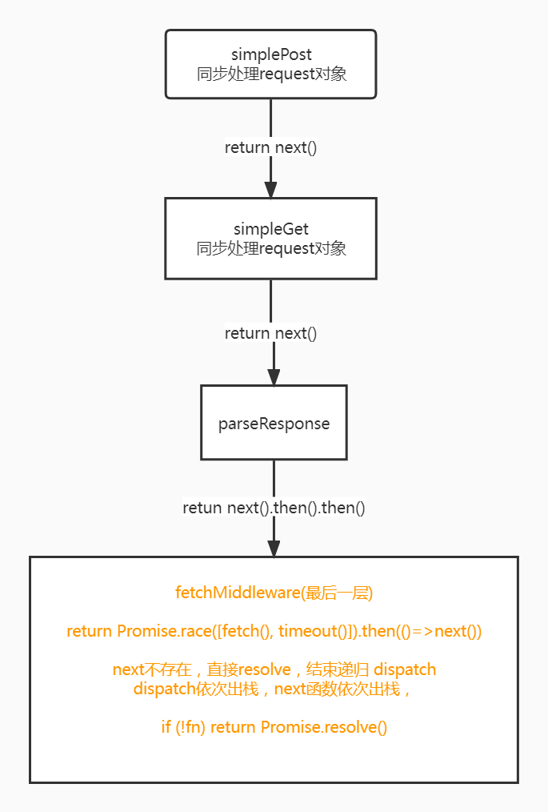

# [umi-request](https://github.com/umijs/umi-request)

The network request library, based on fetch encapsulation, combines the features of fetch and axios to provide
developers with a unified api call method, simplifying usage, and providing common functions such as caching, timeout,
character encoding processing, and error handling.

## 插件机制

umi-request 基于插件实现，内部的洋葱模型 `onion.js` 参考自 [koa](https://github.com/koajs/koa)
的 [koa-compose](https://github.com/koajs/compose)

### 用户自定义中间件

- ctx(Object)：context, content request and response
- next(Function)：function to call the next middleware

```js
request.use(async (ctx, next) => {
    console.log('a1');
    await next();
    console.log('a2');
})
```

中间件执行顺序从左到右，首先执行自定义中间件，在依次执行 **simplePost**(对请求body，即data做处理),**simpleGet**(对请求params做处理，实现 query 简化、 post 简化)，
**parseResponseMiddleware**(解析json,gbk数据)，最后执行 **fetchMiddleware** ,最终发送http请求.

这里会有疑惑，为什么不是先发送请求，再 **parseResponse**, 其实在 `parseResponseMiddleware` 中直接先掉用了 `next()`,即先执行了 `fetchMiddleware`,实际的 parse
response 过程还是在http请求结果返回值后执行的

这里用户定义的中间件默认为 `this.middlewares`, `this.defaultMiddlewares`默认为 `[]`,`Onion.globalMiddlewares`和`Onion.coreMiddlewares`如下

```js
const globalMiddlewares = [simplePost, simpleGet, parseResponseMiddleware];
const coreMiddlewares = [fetchMiddleware];
```

```js
  function execute(params = null) {
    const fn = compose([
        ...this.middlewares,
        ...this.defaultMiddlewares,
        ...Onion.globalMiddlewares,
        ...Onion.coreMiddlewares,
    ]);
    return fn(params);
}
```

### compose 函数
compose 函数返回一个组合了所有插件的“插件”函数，这个函数接受一个http请求的request 对象作为参数，参数被compose从一个个中间件中处理后返回的 promise

闭包函数 dispatch 作为调度函数，每次执行 `next()`,即会调用 dispatch 函数执行下一个中间件，当下一个中间件函数 **return** 时，上一个函数才能继续执行

```js
export default function compose(middlewares) {
    if (!Array.isArray(middlewares)) throw new TypeError('Middlewares must be an array!');

    const middlewaresLen = middlewares.length;
    for (let i = 0; i < middlewaresLen; i++) {
        if (typeof middlewares[i] !== 'function') {
            throw new TypeError('Middleware must be componsed of function');
        }
    }

    return function wrapMiddlewares(params, next) {
        let index = -1;

        function dispatch(i) {
            if (i <= index) {
                return Promise.reject(new Error('next() should not be called multiple times in one middleware!'));
            }
            index = i;
            const fn = middlewares[i] || next;
            if (!fn) return Promise.resolve();
            try {
                return Promise.resolve(fn(params, () => dispatch(i + 1)));
            } catch (err) {
                return Promise.reject(err);
            }
        }

        return dispatch(0);
    };
}
```
调用栈分析




## reference
- [如何更好地理解中间件和洋葱模型](https://juejin.cn/post/6890259747866411022#heading-4)
- [compose函数,js-fp](https://mostly-adequate.gitbook.io/mostly-adequate-guide/appendix_a#compose)
