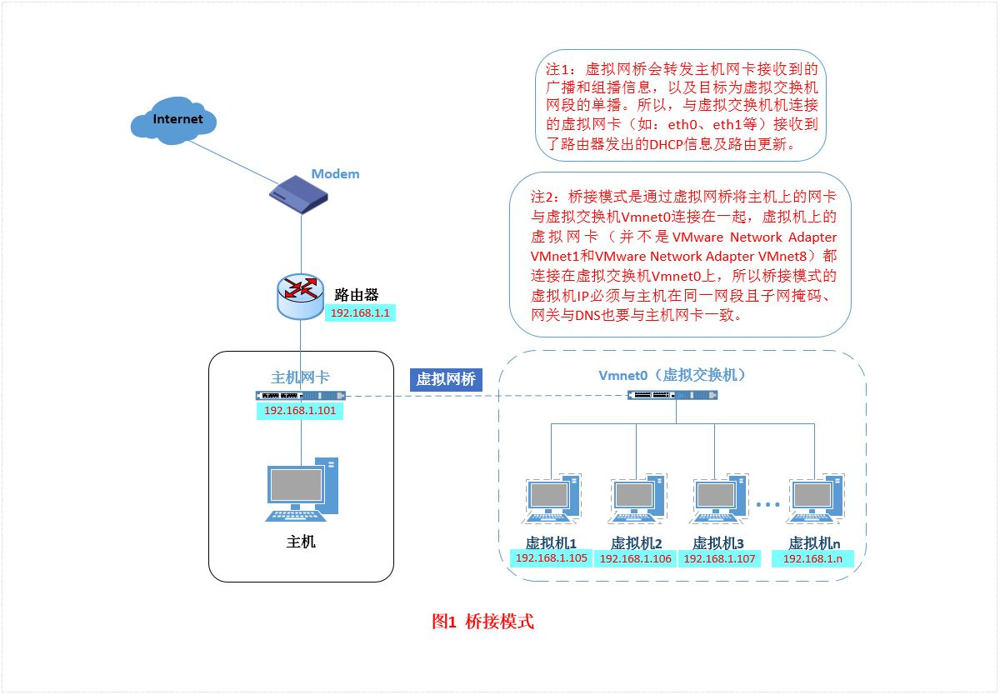
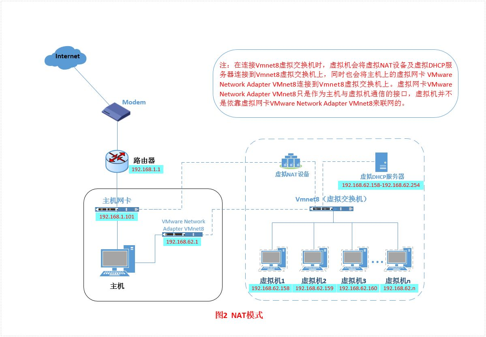
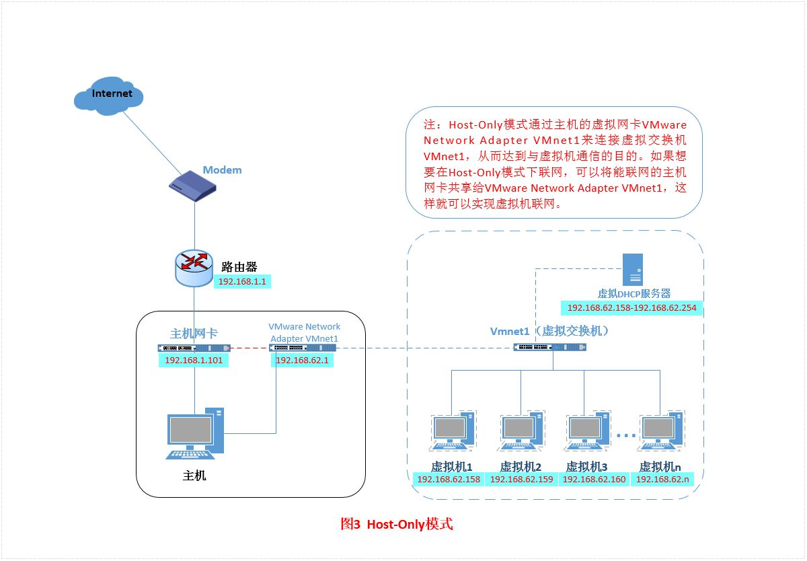

集线器(hub)

交换机：可以记录各个端口所连接设备的 Mac 地址，两个端口之间的设备通信通过交换机进行转发，由于交换机会记录设备的 Mac
地址，可以精准的发送到所要通信的设备，不需要进行广播。另外交换机是全双工通信，就是我们现在用的网线，内部有八根线，正常使用中至少有四根线在工作。不会产生冲突。交换机所处的是数据链路层。交换机可以进行桥接，组成小规模网络互联，交换机可以维系的
Mac
地址和端口映射表在几千到一万之间，当超过这个映射上限时候，新加入的设备由于没有映射mac地址，交换机需要进行广播通信数据进行寻址，这样新设备会添加到映射表中，但旧的映射端口就会被顶替掉。所以当网络规模扩大时候，就会用路由器代替交换机连接两个局域网络。

路由器(Router)：路由器有时候又叫网关，路由工作在OSI模型的第三层——即网络层。

- lan口：local area network，用户端网线口，连接各个终端
- wan口：wide area network，光猫端光纤口，与运营商端连接
- wlan：wireless local area network，无线局域网
- 路由器内部软件组成部分有：
    - 防火墙软件
    - 路由软件(网关)
    - 两层交换机软件：若两个设备属于同一网段，则经过交换机软件直接通信，不需要经过路由软件(网关)
    - 其他软件

- IP地址： ip 地址是一个抽象地址，不能直接用于通信，Mac 地址是真实地址，网络中设备的唯一标识符，网络内部设备互相通信会根据 ip 地址去查询 相应设备的 Mac 地址，所使用的的协议是 ARP (Address resolve
  protocol),比如设备A (192.168.1.25)和设备B (192.168.1.32)之间进行通信，设备A根据 ARP 协议在网络中去广播设备B的ip地址，设备B收到广播后返回自身的Mac地址，然后在 Mac
  层即数据链路层进行数据传输，数据传输过程中每经过一个网络设备转发，数据中的Mac地址的源和目的地址会根据经过的转发设备不断切换， 但数据中的 ip源地址和ip目的地址一直保持不变，，最终抵达所要通信的设备。但有个例外就是 在 NAT
  协议下
  ip地址在传输中会发生变化。Ip地址由网络号和主机号组成，子网掩码就是告诉你那些是IP地址的网络号，那些是主机号的，子网掩码转换成二进制后数字1部位代表的就是ip地址的网络号，0代表的就是主机号，如果两个设备的IP地址网络号相同，则说明这两个设备在同一网段。windows
  cmd 中输入 `ipconfig` 可以查看ip地址

- 回环地址：本地环回环地址时以127开头的地址127.0.0.1 —>
  127.255.255.254，是由http协议规定，用于本地主机的进程间的通信之用。若主机发送一个目的地址为环回地址的IP数据报，则本主机中的协议软件就处理该数据报中数据，而不会将数据报发送到任何网络。目的地址为环回地址的IP数据报永远不会出现在任何网络上，因为网络号为127的地址根本不是网络地址。不可以被公网访问
- 0.0.0.0:
  0.0.0.0，最特殊的一个ip地址，代表的是本机所有ip地址，不管你有多少个网口，多少个ip，如果监听本机的0.0.0.0上的端口，就等于监听机器上的所有ip端口。换句话说，就是只要数据报目的地址是你机器上的一个ip地址，那么就能被接受。这个ip相当于java中的this，代表当前设备的IP
- localhost: localhost时一个域名，如www.baidu.com.其具体的地址时可以配置的，一般情况下默认指向的地址为127.0.0.1。不可以被公网访问

网络中每一台设备都有自己维护的路由表，比如 pc,路由器等等，假如当前我的电脑 ip 是 192.168.0.24，我电脑的路由表会记录默认网关(一般是路由器)的ip地址是
192.168.0.1，路由器其实也是一个Linux系统，内部也维护着一张路由表，路由器内部路由表生成算法很复杂

私网ip地址段

- A类地址： 10.0.0.0～10.255.255.255（大型网络）
- B类地址： 172.16.0.0 ～172.31.255.255 （中型网络）
- C类地址： 192.168.0.0～192.168.255.255（小型网络）

网关：若目标ip在同一网段，则可以直接通信，不需要经过网关，否则就需要网关进行转发。

```shell
# 查看与某个ip通信需要经过那些路由器和网关 windows 命令
# Tracert 命令时都只看到只有一跳的返回结果的原因：问题出在路由器本身不对tracert数据包进行解析
tracert -d ip地址
# domain 转 ip地址 windows 命令
nslookup url地址
# 重新获取ip地址
ipconfig /renew
```

网络适配器：又称网卡

家庭网络结构： 入户光纤 -> 光猫 -> 路由器wan口 -> 路由器lan口 -> 终端

- 猫/光猫：现在猫已经很少了，都是光猫，猫不支持光纤，光猫支持光纤。它的作用是将光纤中的光信号转换成网线中的电信号进行传输.
  最早家庭用户没有路由器，每次上网都需要输入宽带账号密码进行拨号（PPPoE方式），很麻烦，而且只能支持一台设备联网，没有WiFi；有路由器后，路由器可以进行拨号，可以发射WiFi，支持多终端。家庭宽带带宽单位是 Mb(bit)
  ,所以要除以 8 才是我们平常说的带宽

宽带拨号：PPPoE方式与运营商建立一条点对点链路通道。一般由路由器完成拨号工作，也有可能由光猫完成拨号（不建议）。

NAT:network address translation，网络地址转换，局域网内设备访问互联网需要公网ip，否则不能上网，但是公网ip地址有限，当局域网内设备发送数据包至运营商路由器时，这个路由器有 NAT
功能，并配有公网ip地址,它就会将我们的数据包的源ip地址进行转换，转成路由器所在的公网ip，收数据包的时候又会替换回来，家里的路由器也有NAT功能，但是没有公网ip，NAT之后依旧无法上英特网。

DHCP:Dynamic host configuration protocol,当我们将网络中设备的ip地址设置为动态获取时候，DHCP服务器就会根据DHCP协议给客户机分配ip地址，使得客户机可以根据这个ip上网。

家庭WiFi信号差，如何解决？

- 方案一：两个路由器，主路由器 lan 口接副路由器 wan 口，进入副路由器后台，设置上网方式为动态ip（或者 DHCP）,然后放到信号差的区域。缺点就是：不支持漫游，无法从一个WiFi自动切换到另外一个WiFi，需要手动切换
- 方案二：mesh组网，缺点是价格昂贵，优点就是支持漫游

## [VMware 网络模式](https://zhuanlan.zhihu.com/p/24758022)

VMware虚拟机安装完成后，网络控制面板会出现两个虚拟网络适配器，分别代表nat模式和host-only模式。桥接模式下使用的物理主机的真实网卡。

### Bridged (桥接模式)

桥接模式就是将主机网卡与虚拟机虚拟的网卡利用虚拟网桥进行通信。在桥接的作用下，类似于把物理主机虚拟为一个交换机，所有桥接设置的虚拟机连接到这个交换机的一个接口上，物理主机也同样插在这个交换机当中，所以所有桥接下的网卡与网卡都是交换模式的，相互可以访问而不干扰。在桥接模式下，虚拟机ip地址需要与主机在同一个网段，如果需要联网，则网关与DNS需要与主机网卡一致。ip地址资源比较充足的情况下使用桥接模式


### NAT（网络地址转换模式）

用于ip地址比较稀缺的时候使用该模式。使用NAT模式，就是让虚拟系统借助NAT的功能，通过宿主机所在的网络来访问公网。在这种模式下宿主机成为双网卡主机，同时参与现有的宿主局域网和新建的虚拟局域网，但由于加设了一个虚拟的NAT服务器，使得虚拟局域网内的虚拟机在对外访问时，使用的则是宿主机的IP地址，这样从外部网络来看，只能看到宿主机，完全看不到新建的虚拟局域网。

默认情况下VMware和虚拟机的配置都不需要修改，所以NAT模式是最简单的。

在NAT模式中，主机网卡直接与虚拟NAT设备相连，然后虚拟NAT设备与虚拟DHCP服务器一起连接在虚拟交换机VMnet8上，这样就实现了虚拟机联网。NAT模式，利用虚拟的NAT设备以及虚拟DHCP服务器来使虚拟机连接外网，而VMware
Network Adapter VMnet8虚拟网卡是用来与虚拟机通信的



### Host-Only（仅主机模式）

在某些特殊的网络调试环境中，要求将真实环境和虚拟环境隔离开，这时你就可采用host-only模式，在这种模式下宿主机上的所有虚拟机是可以相互通信的，但虚拟机和真实的网络是被隔离开的。

Host-Only模式其实就是NAT模式去除了虚拟NAT设备，然后使用VMware Network Adapter
VMnet1虚拟网卡连接VMnet1虚拟交换机来与虚拟机通信的，Host-Only模式将虚拟机与外网隔开，使得虚拟机成为一个独立的系统，只与主机相互通讯。但其实可以通过XP或win7的网络共享功能使虚拟机与外网连接




server {
        listen       443  ssl;
        server_name  api.weixin.qq.com;
        ssl_certificate /etc/nginx/cert/ndkjcx.com.pem;
        ssl_certificate_key /etc/nginx/cert/ndkjcx.com.key;
        ssl_session_timeout 5m;

        client_max_body_size 200m;

        location / {
           proxy_pass http://10.60.114.2:5000;
        }

}

extra_hosts:
- "api.weixin.qq.com:10.60.114.2"
