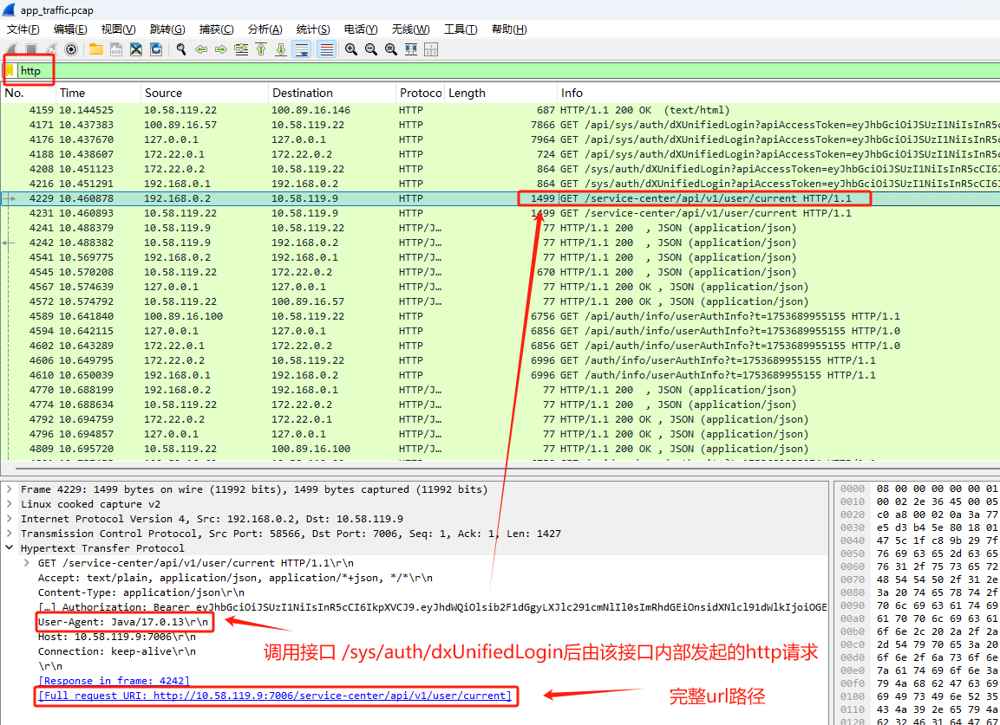

tcpdump 抓取的数据包顺序 基本与网络传输的物理顺序一致

```shell
# 捕获全部流量并保存到文件 app_traffic.pcap
tcpdump -i any -w app_traffic.pcap

# 下载 app_traffic.pcap 到Windows上面，用 Wireshark 打开分析
wireshark app_traffic.pcap
```

在 Wireshark 中设置过滤条件(自定义过滤条件)，比如 `http`

然后分析请求定位问题，如下，`springBoot` 项目接口报错  `The plain HTTP request was sent to HTTPS port`，最早开发时候由于没有配置 `https`
证书，接口不报错，之后 `7006` 端口改为了
`ssl` 端口，继续发送 `http` 请求到 `https` 端口报错


