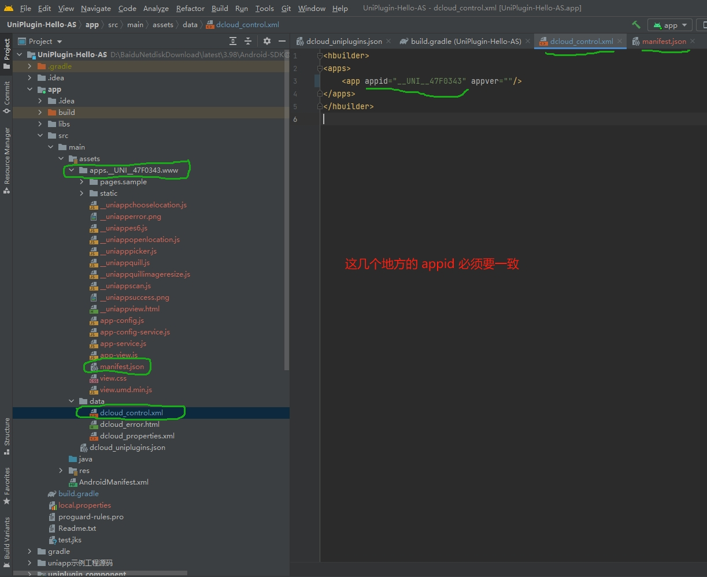
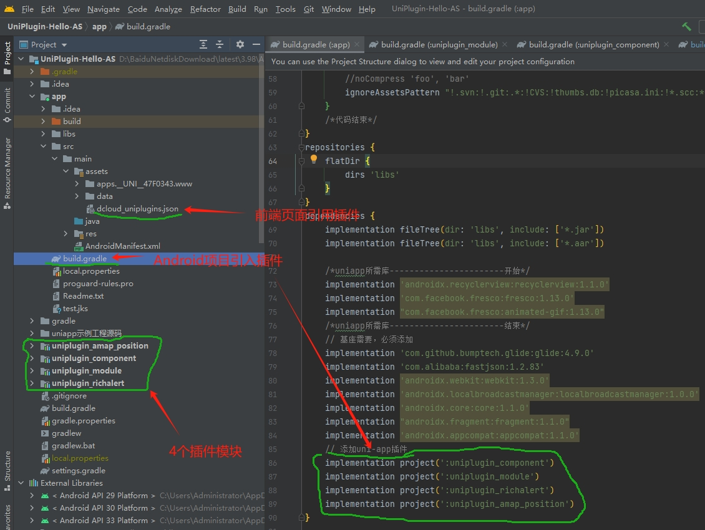

## 名词

- `wap2app`: wap2app 是一个将现有M站（也称手机wap站，区别于pc的web站）快速发布成 App 的增强方案，通过 DCloud 的 wap2app
  框架，进行简单的配置和必要的编程，即可完成M站的体验强化，达到原生应用的功能体验，进而再发布为原生安装包或流应用。
- `uniapp`: 开发者编写一套代码，可发布到iOS、Android、Web（响应式）、以及各种小程序（微信/支付宝/百度/头条/QQ/钉钉/淘宝）、快应用等多个平台。
- `5+ APP`: HTML5 Plus移动App，简称5+App，是一种基于HTML、JS、CSS编写的运行于手机端的App，这种App可以通过扩展的JS API任意调用手机的原生能力，实现与原生App同样强大的功能和性能。
  其实就是个html 5 的手机网页。但用这个框架功能更强大。`Native.js的详细教程可以参考：5+ App开发Native.js入门指南`

## uniapp 插件开发

- uniapp appkey 配置错误

  
- uniapp plugin 开发
  
