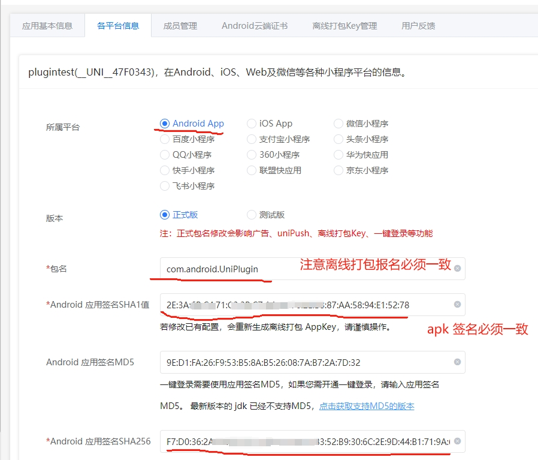
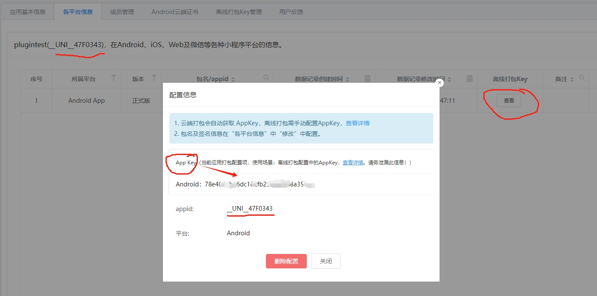

## 名词

- `wap2app`: wap2app 是一个将现有M站（也称手机wap站，区别于pc的web站）快速发布成 App 的增强方案，通过 DCloud 的 wap2app
  框架，进行简单的配置和必要的编程，即可完成M站的体验强化，达到原生应用的功能体验，进而再发布为原生安装包或流应用。
- `uniapp`: 开发者编写一套代码，可发布到iOS、Android、Web（响应式）、以及各种小程序（微信/支付宝/百度/头条/QQ/钉钉/淘宝）、快应用等多个平台。
- `5+ APP`: HTML5 Plus移动App，简称5+App，是一种基于HTML、JS、CSS编写的运行于手机端的App，这种App可以通过扩展的JS API任意调用手机的原生能力，实现与原生App同样强大的功能和性能。
  其实就是个html 5 的手机网页。但用这个框架功能更强大。`Native.js的详细教程可以参考：5+ App开发Native.js入门指南`

## uniapp 插件开发

- uniapp 离线打包 配置app签名
  
- uniapp 离线打包 申请appKey
  
- uniapp appkey 配置错误
  
- uniapp plugin 开发
  
- [微信开放平台Android平台应用签名怎么填写](https://www.yimenapp.com/kb-yimen/1716/):
  我们可以拿到MD5为：`24:D2:CA:F6:3A:1A:13:ED:8D:B6:8E:19:82:E1:F3:F5`,
  但是微信开放平台输入这个格式则是错误的，我们需要去掉中间的间隔“：”冒号，最终我们输入：`24D2CAF63A1A13ED8DB68E1982E1F3F5`，这个就是微信开放平台需要的安卓 APP 签名的 MD5，也就是平台所需的应用签名。

## uniapp 开发注意事项

- `uni.getSystemInfoSync`: 这个接口必须在 `onReady` 中调用，不能在 app 的 `onLaunch` 中调用,否则会导致高度计算不准确
    - `屏幕高度` = `原生NavigationBar高度（含状态栏高度）` + `可使用窗口高度` + `原生TabBar高度`
    - `windowHeight` 不包含 `NavigationBar` 和 `TabBar` 的高度
    - Web端，`windowTop` 等于 `NavigationBar` 高度，`windowBottom` 等于 `TabBar` 高度
    - App端，`windowTop` 等于透明状态 `NavigationBar` 高度，`windowBottom` 等于透明状态 `TabBar` 高度
    - 高度相关信息，要放在 `onReady` 里获取。太早取不到
