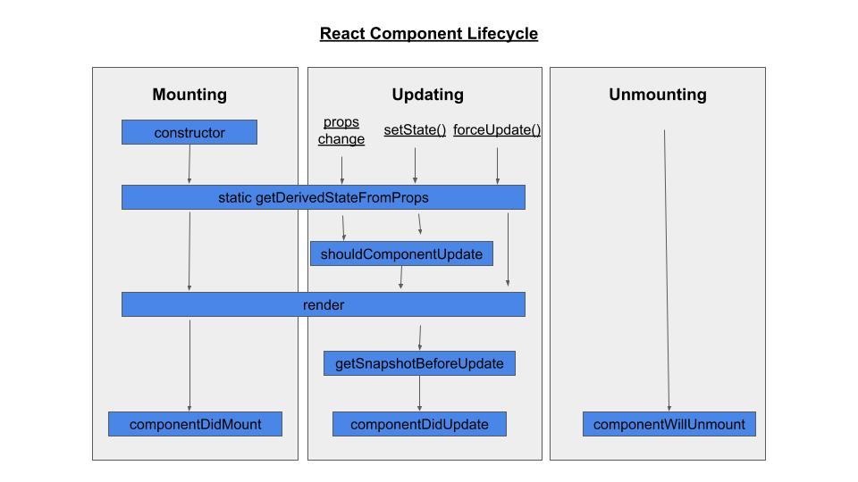

## react api

### useCallback

`React.useCallback(fn, dependencies)` : 缓存传入的 **fn** 函数，并不会调用 **fn**

### [Adding a Ref to a Class Component](https://legacy.reactjs.org/docs/refs-and-the-dom.html#adding-a-ref-to-a-class-component)

using ref to reference a class component instance

```tsx
// 这里的 ref 引用的是 AutoFocusTextInput 实例
class AutoFocusTextInput extends React.Component {
    constructor(props) {
        super(props);
        this.textInput = React.createRef();
    }

    componentDidMount() {
        this.textInput.current.focusTextInput();
    }

    render() {
        return (
            <CustomTextInput ref={this.textInput}/>
        );
    }
}
```

But you may not use the ref attribute on function components because they don’t have instances.

If you want to allow people to take a ref to your **function component**, you can use `forwardRef` (possibly in
conjunction with `useImperativeHandle`), or you can **convert** the component to a **class**.

You can, however, use the ref attribute inside a function component as long as you refer to a **DOM element** or a **
class component**:

### forwardRef

`React.forwardRef((props,ref)=>{return ReactComponent})` : lets your component expose a DOM node to parent component
with a `ref`.
`forwardRef` accepts a render function as an argument. React calls this function with props and `ref`
`forwardRef` returns a React component,a component returned by forwardRef is also able to receive a ref prop,使用这个返回的
component 时候，传入 ref prop 即可。

- ref object

```tsx
const myRef = useRef(null);
<div ref={myRef}>
```

- ref callback

````tsx
<div ref={(node) => console.log(node)}/>
````

#### [useRef() Hook on a custom component](https://stackoverflow.com/questions/61192450/useref-hook-on-a-custom-component)

On custom components, ref needs to be **forwarded**.
This is because `ref` is (usually) a reference to a DOM element. A React Component can renders multiple DOM element, so
you need to be explicit about where the ref should be assigned to.

```tsx
const salesRef = useRef(null)
return (<Sales ref={salesRef}/>)

// inside Sales.js
// assigns the ref to an actual DOM element, the div
const Sales = (props, ref) => (
    <div ref={ref}></div>
)

export default React.forwardRef(Sales);

```

When the `<div>` DOM node is added to the screen, React will call your `ref` callback with the DOM node as the argument.
When that `<div>` DOM node is removed, React will call your ref callback with `null`.

### [useLayoutEffect](https://react.dev/reference/react/useLayoutEffect)

is a version of `useEffect` that fires before the browser repaints the screen.

React guarantees that the code inside `useLayoutEffect` and any state updates scheduled inside it will be processed
before
the browser repaints the screen. This lets you render the tooltip, measure it, and re-render the tooltip again without
the user noticing the first extra render. In other words, useLayoutEffect **blocks** the browser from painting

### [React elements vs React nodes](https://stackoverflow.com/questions/58123398/when-to-use-jsx-element-vs-reactnode-vs-reactelement)

- A ReactElement is an object with a type and props
- A ReactNode is a ReactElement, a ReactFragment, a string, a number or an array of ReactNodes, or null, or undefined,
  or a boolean

`React.isValidElement` checks whether the argument is a `React element`, not whether it’s a `React node`.

### [useMemo vs useCallback](https://react.dev/reference/react/useCallback#how-is-usecallback-related-to-usememo)

- `useMemo` caches the result of calling your function.

- `useCallback` caches the function itself. Unlike `useMemo`, it does not call the function you provide.

### [react lifecycle vs hooks](https://retool.com/blog/the-react-lifecycle-methods-and-hooks-explained/)

React has four built-in methods that gets called, in this order, when mounting a component:

- `constructor()`
- `getDerivedStateFromProps()`
- `render()`
- `componentDidMount()`

The render() method is required and will always be called, the others are optional and will be called if you define
them.

React has five built-in methods that gets called, in this order, when a component is updated:

- `getDerivedStateFromProps()`
- `shouldComponentUpdate()`
- `render()`
- `getSnapshotBeforeUpdate()`
- `componentDidUpdate()`

The `render()` method is required and will always be called, the others are optional and will be called if you define
them

- `componentDidMount`: React will call it when your component is added (mounted) to the screen
- `componentDidUpdate`: component re-renders due to changed props or state.
- `componentWillUnmount`: component has been removed (unmounted) from the screen.



in development when **Strict Mode** is on, React will call componentDidMount, immediately call componentWillUnmount, and
then call componentDidMount again.

#### hooks lifecycle

- `useEffect(setup, dependencies?)`

The `useEffect` hook works similarly to the three lifecycle methods: `componentDidMount`, `componentDidUpdate`,
and `componentWillUnmount`.

when the dependencies array is empty, the setup function only get called once; it works similarly to `componentDidMount`
;

if the dependencies isn't empty,
everytime when the dependencies changed, the setup function get called, it works similarly to `componentDidUpdate`;

useEffect will return a **fn** which will automatically get called when the component unmount, it works similarly
to `componentWillUnmount`

#### [check components mounted status](https://jasonwatmore.com/post/2021/08/27/react-how-to-check-if-a-component-is-mounted-or-unmounted)

```tsx
import React, {useEffect, useRef} from 'react';

export {ExampleComponent};

function ExampleComponent() {
    const mounted = useRef(false);

    useEffect(() => {
        // The useEffect() hook is called when the component is mounted and sets the mounted.current value to true
        mounted.current = true;
        // clean up
        return () => {
            mounted.current = false;
        };
    }, []);

    return (<MyComponent/>);
}
```

### [React.useImperativeHandle(ref, createHandle, dependencies?)](https://react.dev/reference/react/useImperativeHandle)

`useImperativeHandle` is a React Hook that lets you customize the handle exposed as a `ref`
Parameters

- The `ref` you received as the second argument from the `forwardRef` render function.
- createHandle: A function that takes no arguments and returns the ref handle you want to expose. That ref handle can
  have any type. Usually, you will return an object with the methods you want to expose.

```tsx
// expose custom methods that you want to expose to parent components
// in other words ,parent ref not has full access to dom element
// forwardref is no longer bind to dom element, instead, create a new ref in MyInput component,bind it to actual dom element
import {forwardRef, useRef, useImperativeHandle} from 'react';

const MyInput = forwardRef(function MyInput(props, ref) {
    const inputRef = useRef(null);

    useImperativeHandle(ref, () => {
        return {
            focus() {
                inputRef.current.focus();
            },
            scrollIntoView() {
                inputRef.current.scrollIntoView();
            },
        };
    }, []);

    return <input {...props} ref={inputRef}/>;
});
```

### [React.memo(Component, arePropsEqual?)](https://react.dev/reference/react/memo)

- arePropsEqual: A function that accepts two arguments: the component’s previous props, and its new props. It should
  return true if the old and new props are equal: that is, if the component will render the same output and behave in
  the same way with the new props as with the old. Otherwise it should return false. Usually, you will not specify this
  function. By default, React will compare each prop with Object.is

Wrap a component in memo to get a memoized version of that component. This memoized version of your component will
usually not be re-rendered when its parent component is re-rendered as long as its props have not changed

### [ReactDOM.createPortal(children, domNode, key?)](https://react.dev/reference/react-dom/createPortal)

createPortal lets you render some children into a different part of the DOM. createPortal returns a React node that can
be included into JSX or returned from a React component

- children: Anything that can be rendered with React, such as a piece of JSX (e.g. `<div />` or `<SomeComponent />`), a
  Fragment (`<>...</>`), a string or a number, or an array of these
- domNode: Some DOM node, such as those returned by `document.getElementById()`. The node must already exist. Passing a
  different DOM node during an update will cause the portal content to be recreated.

- optional key: A unique string or number to be used as the portal’s key.

### setState(nextState, callback?)

nextState: Either an object or a function.

- If you pass an object as nextState, it will be shallowly merged into this.state.
- If you pass a function as nextState, it will be treated as an updater function. It must be pure, should take the
  pending state and props as arguments, and should return the object to be shallowly merged into this.state. React will
  put your updater function in a queue and re-render your component. During the next render, React will calculate the
  next state by applying all of the queued updaters to the previous state.

## react util

- useId: 返回全局的 id,兼容了 `React.useId` api
- render: 兼容了 react 各个版本的 React.createRoot().render() 方法

