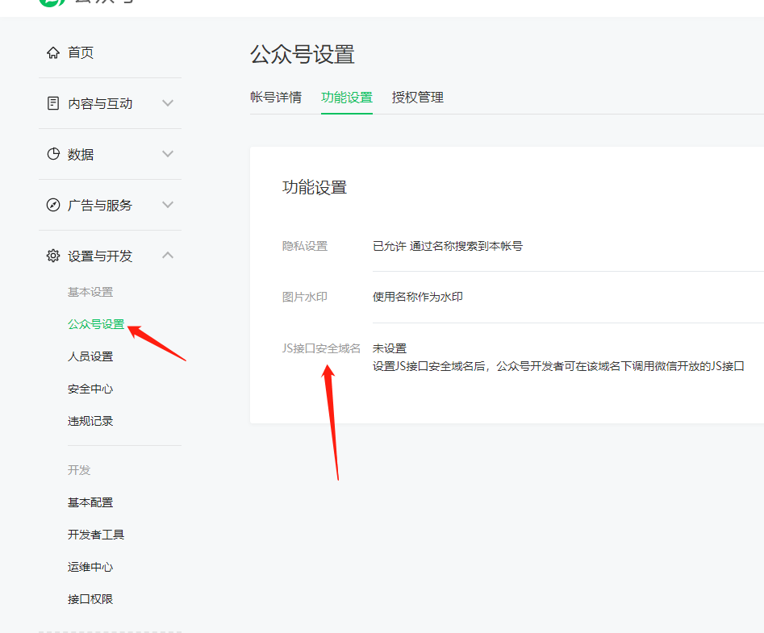
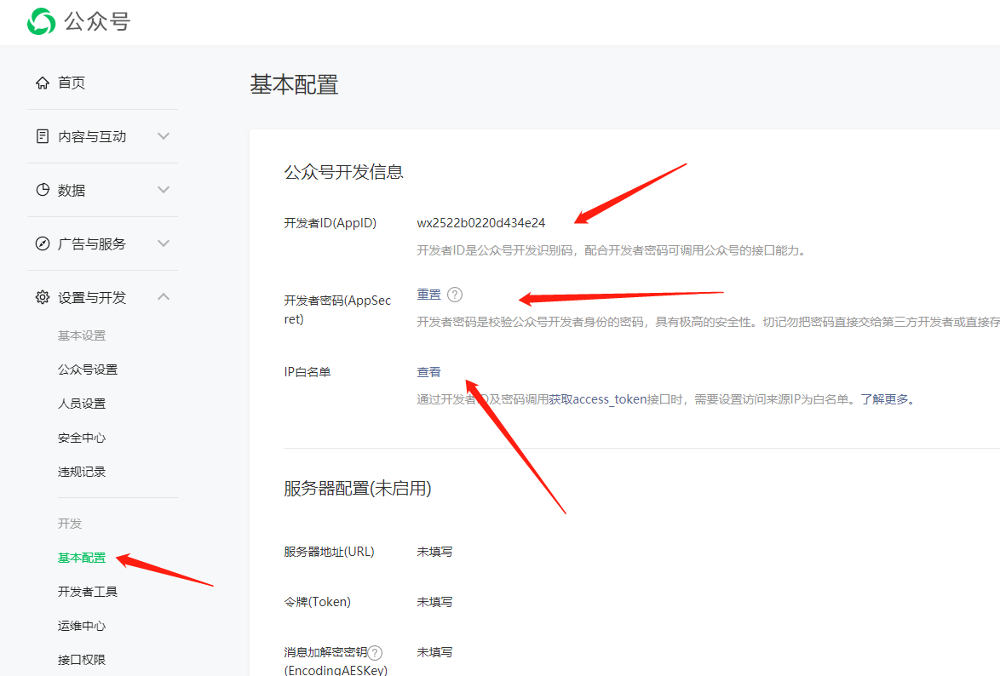

## 申请微信测试账号

- 修改本地host文件：windows路径 `C:\Windows\System32\drivers\etc`,将本地host改为任意域名，比如`tumbleweed.top`
- [登录微信公众平台](https://mp.weixin.qq.com/),  进入 `开发-开发者工具-公众平台测试账号` 申请测试账号
- 在 `JS接口安全域名修改` 中配置自定义的本地域名 `tumbleweed.top`
- 关注测试号二维码 （如果多人开发，都要关注这个测试账号）

## 安装手机代理软件
由于我们的域名是自定义的假域名，并不存在，所以需要将手机的网络代理到电脑上，由电脑端向微信服务器发送请求
 ### 安装charles并测试
 charles是一款收费软件，下载安装之后，在 `proxy-setting` 中查看http代理端口，默认是 `8888`,将手机和电脑接入统一局域网中，打开手机 WiFi 连接，配置手动代理，输入电脑的IP地址和代理端口 `8888`
 
 在电脑上启动本地调试服务，注意要运行在80端口下面，微信sdk只支持(http 80或者https 443),比如运行在 `http://tumbleweed.top`,如果使用的是vue开发，需要在`vue.config.js`中配置以下字段
 
 ```text
    devServer: {
        disableHostCheck: true,
        port:80,
        host:'tumbleweed.top'
    }
```
在手机上访问 `http://tumbleweed.top`,如果能访问成功，则表明代理软件已经配置成功（注意charles会弹出确认代理连接操作弹框）


## 服务端代码
@[code js](../_code/wechat/wechat_sdk_node/app.js)
## 前端代码
::: tip
所有需要使用JS-SDK的页面必须先注入配置信息，否则将无法调用.（同一个url仅需调用一次，对于变化url的SPA的web app可在每次url变化时进行调用),url（当前网页的URL，不包含#及其后面部分）

以微信扫一扫功能为例，每个需要调用扫一扫的页面需要先初始化SDK，调用后台生成签名接口时需要传入前页面的url
:::

@[code js](../_code/wechat/wechat_sdk_html/sdk.vue)

## 线上部署配置
### JS接口安全域名
设置需要调用js-sdk的 H5 页面


### 微信IP白名单设置
通过开发者ID及密码调用获取access_token接口时，需要设置访问来源IP为白名单（初始化js-sdk的时候需要后台服务器与微信服务器进行交互，获取access_token,需要添加后台服务器ip至微信公众号白名单中）

目的：为了提高公众平台开发者接口调用的安全性，避免一旦开发者ID和密码泄露后给帐号造成损失。对调用“获取access_token”接口增加IP白名单校验：只有将IP地址设置为公众号的IP白名单，才能成功调用该接口


## 参考链接
[微信SDK官方文档](https://developers.weixin.qq.com/doc/offiaccount/OA_Web_Apps/JS-SDK.html#1)

[微信SDK官方demo](https://developers.weixin.qq.com/doc/offiaccount/OA_Web_Apps/JS-SDK.html#67)
